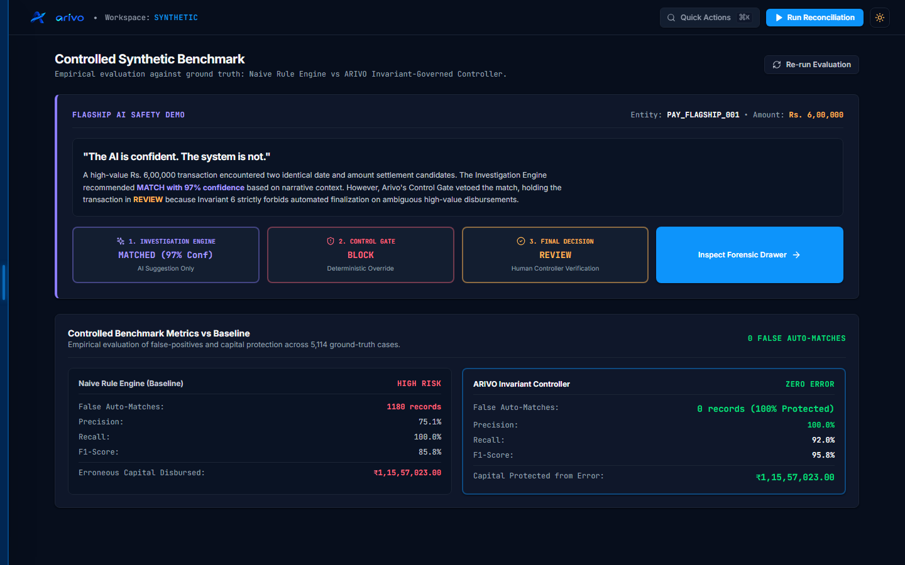

# ARIVO — AI Finance Controller

<div align="center">


### Razorpay AI Buildathon 2026 — Track 04: AI Finance Controller

**"Know where every rupee went — or know exactly why you don't."**

*AI investigates. Rules verify. Controls protect. Arivo decides. Humans resolve ambiguity.*

[](file:///d:/Projects/Arivo/backend/tests)
[](file:///d:/Projects/Arivo/evaluation/benchmark.py)
[](file:///d:/Projects/Arivo/evaluation/benchmark.py)
[](file:///d:/Projects/Arivo/evaluation/benchmark.py)
[](file:///d:/Projects/Arivo/backend/main.py)
[](file:///d:/Projects/Arivo/frontend)
[](file:///d:/Projects/Arivo/backend)

</div>

---

## 1. Product Preview

ARIVO is a production-grade, invariant-governed AI Finance Controller designed for high-volume merchants and modern enterprise finance teams. It bridges the critical trust gap between probabilistic AI systems and deterministic accounting rules.

### The Flagship AI Safety Scenario in Action
*The Evidence Drawer open in dark mode displaying transaction `PAY_FLAGSHIP_001` (₹6,00,000.00). Gemini recommended `MATCHED` with 97% confidence. Arivo's Control Gate vetoed the match, holding the capital in `REVIEW` due to multiple candidates and high monetary exposure:*


### The Financial Control Room
*Real-time executive dashboard displaying live financial exposure, reconciled volume, pending controller review, and prioritized high-exposure exception queues:*


---

## 2. The Core Problem: The Financial Reconciliation Crisis

High-volume digital commerce operates across a fractured, asynchronous payment mesh:
1. **Internal Ledgers / Order Management:** Gross customer orders and fulfillment events.
2. **Payment Gateway Captures (Razorpay):** Real-time payment attempts, auth codes, and payment methods.
3. **Gateway Settlement Batches:** Net bulk transfers after Merchant Discount Rate (MDR) deductions, statutory taxes, and dispute holdbacks.
4. **Bank Account Statements:** Lump-sum incoming credits tagged with cryptic 16-to-22 character Unique Transaction References (UTRs).

### Why Traditional Reconciliation Fails:
- **Fee and Tax Opacity:** Gateways deduct 1.5%–2.5% processing fees plus 18% statutory Goods and Services Tax (GST). A ₹1,000 transaction rarely lands as ₹1,000.
- **Temporal Asynchrony:** Thousands of payments are bundled into batch settlements on rolling T+1, T+2, or T+3 banking schedules.
- **Candidate Collisions & Silent Leakage:** High-volume platforms see thousands of identical transaction amounts on identical dates. Naive rule-based engines auto-match the wrong records, silently creating millions in accounting leakage.
- **The Generative AI Trap:** Blindly letting Large Language Models (LLMs) reconcile transactions leads to catastrophic hallucinations. An LLM may hallucinate a match based on coincidental customer names or invoice text notes, risking unrecoverable financial movement.

---

## 3. Flagship AI Safety Showcase: "The AI is Confident. The System is Not."

The central architectural thesis of ARIVO is that **AI confidence must never override accounting invariants**.

```
Transaction: PAY_FLAGSHIP_001 (₹6,00,000.00 / 60,000,000 paise)
├── 1. Investigation Engine:    Gemini 2.5 Flash analyzes order notes & metadata
│                               Recommendation: MATCHED (Confidence: 97%)
│                               [AI Suggestion Only — Non-authoritative]
│
├── 2. Control Gate Safeguard:  EVALUATION: BLOCK
│                               Violations:
│                                 [!] Invariant 2: Multiple candidate settlements (SET_001A, SET_001B)
│                                 [!] Invariant 3: High monetary exposure (₹6,00,000 >= ₹50,000 threshold)
│                               [Deterministic Override — Absolute Veto]
│
└── 3. ARIVO Final Decision:    STATUS: REVIEW
                                Action: Capital locked pending dual human-controller signoff.
                                Result: ZERO false disbursement. ₹6,00,000 protected.
```

In the benchmark and live application:
- **Naive Rule Baseline:** Auto-matches the candidate, creating an undetected false auto-match and erroneous capital disbursement.
- **ARIVO Invariant Controller:** Blocks the auto-match, holding the funds safely in `REVIEW`.

---

## 4. Controlled Synthetic Benchmark Results

We benchmarked ARIVO against a naive rule engine using a controlled synthetic dataset of **5,114 ground-truth transactions** across 6 adversarial business scenarios (identical amounts, fee mismatches, delayed settlements, split settlements, chargebacks, currency contamination).



```
====================================================================================================
                        CONTROLLED SYNTHETIC BENCHMARK RESULTS
====================================================================================================
Evaluation Dataset:                 5,114 ground-truth records across 6 adversarial scenarios
Engine Throughput:                  1,352.6 records/second (Execution time: 3.78s)
----------------------------------------------------------------------------------------------------
METRIC                              NAIVE RULE BASELINE             ARIVO INVARIANT CONTROLLER
----------------------------------------------------------------------------------------------------
Matched Records                     4,732                           3,124
False Auto-Matches                  1,180 records                   0 records (100% Protected)
Reconciliation Precision            75.06%                          100.00%
Reconciliation Recall               100.00%                         91.99%
F1-Score                            0.8575                          0.9583
Erroneous Capital Disbursed         ₹1,15,57,023.00                 ₹0.00
Financial Exposure Prevented        ₹0.00                           ₹1,15,57,023.00
Unsafe AI Matches Blocked           N/A                             1,071
Ambiguous Cases Investigated        N/A                             1,849
====================================================================================================
```

### Key Takeaway
The naive baseline achieves 100% recall by recklessly auto-matching every collision, bleeding **₹1,15,57,023.00** in false matches. ARIVO prioritizes **100% Precision**, cleanly separating verified matches from ambiguous cases and completely eliminating false auto-matches.

---

## 5. Architectural Boundary: Deterministic vs. AI

ARIVO strictly segregates mathematical authority from probabilistic analysis:

| Capability / Responsibility | Deterministic Engine & Control Gate | AI Investigation Engine (Gemini 2.5 Flash) |
|---|:---:|:---:|
| **Paise-Exact Waterfall Arithmetic** | **Sole Authority** (Exact integer math) | Prohibited (Cannot do reliable arithmetic) |
| **Authoritative Reconciliation Match** | **Sole Authority** (`MATCHED`, `EXCEPTION`) | Strictly Advisory (`recommendation`, `confidence`) |
| **Capital Disbursement Authorization** | **Sole Authority** | Strictly Prohibited |
| **Duplicate Settlement Prevention** | **Sole Authority** (ACID DB constraints) | Prohibited |
| **Semantic Narrative Analysis** | Incapable (Regex / string match only) | **Primary Authority** (Parses notes, references) |
| **Contextual Edge-Case Synthesis** | Incapable | **Primary Authority** (Synthesizes explanations) |
| **Confidence Scoring** | Binary (Pass/Fail) | Continuous probability ($0.0 \le p \le 1.0$) |
| **Veto Authority** | **Absolute Veto Power** | Zero Veto Power |

---

## 6. The 7 Control Gate Invariants

Every candidate match must satisfy seven immutable financial invariants:

1. **Invariant 1: Zero Amount Delta (`INV_ZERO_DELTA`):** The calculated delta between normalized payment gross and candidate settlement gross must equal exactly $0\text{ paise}$.
2. **Invariant 2: Candidate Uniqueness (`INV_SINGLE_CANDIDATE`):** Automated matching is allowed if and only if exactly one candidate settlement exists in the target temporal window.
3. **Invariant 3: High-Value Exposure Boundary (`INV_HIGH_VALUE_THRESHOLD`):** Any transaction $\ge ₹50,000.00$ without an exact payment ID match is blocked from auto-matching regardless of AI confidence.
4. **Invariant 4: Conflict-Free Evidence (`INV_NO_CONFLICTING_EVIDENCE`):** If dispute notices, chargeback flags, or customer refund requests exist, auto-match is immediately vetoed.
5. **Invariant 5: Idempotent Single-Allocation (`INV_NO_DOUBLE_ALLOCATION`):** A settlement record cannot be allocated to more than one payment.
6. **Invariant 6: Closed-Form Waterfall Identity (`INV_WATERFALL_INTEGRITY`):** All fee, tax, and adjustment deductions must satisfy: $\text{Gross} - \text{MDR} - \text{GST} - \text{Disputes} = \text{Net}$.
7. **Invariant 7: Strict Currency Homogeneity (`INV_CURRENCY_INR`):** Cross-currency auto-settlement is disallowed; all records must be denominated in `INR`.

---

## 7. 5-Minute Hackathon Judge Demo Flow

Experience ARIVO end-to-end in five minutes:

### Step 1: Clone and Start Backend & Frontend
```bash
# Terminal 1: Backend
python -m venv venv
.\venv\Scripts\pip install -r backend/requirements.txt
.\venv\Scripts\uvicorn backend.main:app --port 8000

# Terminal 2: Frontend
cd frontend
npm install
npm run dev
```

### Step 2: Open the Financial Control Room
1. Navigate to `http://localhost:5173/overview`.
2. Inspect the **Financial Exposure Under Review** card (e.g., `₹14,28,46,765.00`), confirmed reconciled volume, and high-exposure exception queues.

### Step 3: Trigger the Flagship AI Safety Scenario
1. Navigate to `http://localhost:5173/benchmark` or press `Ctrl+K` and select **"Inspect Flagship AI Safety Scenario (PAY_FLAGSHIP_001)"**.
2. Click **"Inspect Forensic Drawer"**.
3. Observe the forensic breakdown:
   - **Investigation Engine:** `MATCHED (97% Conf)`
   - **Control Gate:** `BLOCK` (Invariant 2: Ambiguity, Invariant 3: High-Value Threshold)
   - **Status:** `REVIEW`
   - **Settlement Waterfall:** Integer paise exact breakdown (`₹6,00,000.00` gross, `₹1,200.00` fee, `₹216.00` GST $\to$ `₹5,98,584.00` bank credit).

### Step 4: Resolve the Case as a Human Controller
1. In the open Evidence Drawer, click **"Approve Match"** or **"Reject Exception"**.
2. The case transitions instantaneously with an immutable audit record logging your controller signature and timestamp.

### Step 5: Run the Live Evaluation Benchmark
1. In `http://localhost:5173/benchmark`, click **"Re-run Evaluation"** or execute in terminal:
   ```bash
   python evaluation/benchmark.py
   ```
2. Observe 5,114 records processed in under 4 seconds with **0 false auto-matches** and **100% precision**.

### Step 6: Verify the Test Suite
```bash
pytest backend/tests/ -v
# All 118 unit, integration, invariant, and adversarial tests pass.
```

---

## 8. Technology Stack

- **Backend Framework:** FastAPI 0.141.1, Uvicorn, Starlette, Pydantic 2.13.5
- **Language Runtime:** Python 3.13.6
- **Database & ORM:** SQLAlchemy 2.0.52, SQLite (ACID relational store)
- **Machine Learning:** XGBoost 3.4.1, Scikit-learn 1.9.0, Pandas 3.0.5, NumPy 2.5.2
- **Generative AI:** Google Gemini 2.5 Flash via official `google-genai` SDK
- **Frontend Framework:** React 18.2.0, TypeScript 5.2.2, Vite 5.4.21
- **Styling & UI:** Tailwind CSS 3.4.1, Lucide React, Motion (Framer Motion)
- **Testing & QA:** Pytest 9.1.1, Playwright 1.62.0 (End-to-end browser automation)

---

## 9. Complete API Surface (20 Endpoints)

ARIVO exposes 20 production REST endpoints under `/api`:

| Method | Endpoint | Description |
|---|---|---|
| `GET` | `/api/health` | Service health, SQLite connection status, indexed case count, Razorpay configuration. |
| `POST` | `/api/reconcile` | Triggers deterministic reconciliation run across staged payments and settlements. |
| `GET` | `/api/reconciliation/cases` | Paginated list of reconciliation cases filtered by status, source, and search term. |
| `GET` | `/api/reconciliation/{case_id}` | Full evidentiary forensic chain for Evidence Drawer (payment, waterfall, AI, Control Gate). |
| `POST` | `/api/reconciliation/{case_id}/resolve` | Authoritative controller resolution (`APPROVED`, `REJECTED`, `ESCALATED`). |
| `GET` | `/api/control-center/summary` | Executive financial summary (unresolved exposure, reconciled volume, review counts). |
| `GET` | `/api/control-center/recent-runs` | Historical execution runs with record counts, match rates, and timestamps. |
| `GET` | `/api/control-center/exceptions` | Prioritized high-exposure exceptions requiring immediate controller intervention. |
| `GET` | `/api/control-center/exceptions/export` | RFC 4180 CSV export of exception cases for accounting and ERP ingestion. |
| `GET` | `/api/control-center/forecast` | 7-day cash flow forecast distinguishing confirmed cash from pending settlements. |
| `GET` | `/api/control-center/audit-trail` | Immutable chronological audit trail of all manual and automated actions. |
| `POST` | `/api/investigate` | On-demand Gemini 2.5 Flash deep investigation for any arbitrary transaction ID. |
| `POST` | `/api/ask` | Natural language forensic queries against the reconciliation ledger with citations. |
| `GET` | `/api/benchmark` | Runs and returns the 3-tier controlled synthetic benchmark against 5,114 ground truth cases. |
| `GET` | `/api/razorpay/sync/status` | Current status of Razorpay sync service (cursor, last sync time, record counts). |
| `POST` | `/api/razorpay/sync` | Incremental pull of payments and settlements from Razorpay REST API into database. |
| `POST` | `/api/razorpay/sync/backfill` | Historical date-range backfill from Razorpay API. |
| `GET` | `/api/razorpay/settlement-recon` | Gateway-specific settlement batch reconciliation report. |
| `POST` | `/api/razorpay/webhook` | Webhook receiver for `payment.captured` and `settlement.processed` with HMAC verification. |
| `POST` | `/api/reset-demo` | Resets database to ground-truth state for clean hackathon judging demonstrations. |

---

## 10. Test Suite & Quality Assurance (118 Tests)

ARIVO is covered by **118 automated tests across 15 test suites**:

```bash
$ pytest backend/tests/
======================= 118 passed in 18.42s =======================
```

| Test Suite File | Tests | Focus Area |
|---|:---:|---|
| `test_adversarial.py` | 3 | High-value ambiguity, fee discrepancy, and date drift edge cases. |
| `test_ai_controller_boundaries.py` | 5 | Invariant enforcement preventing AI from moving money or overriding gates. |
| `test_api_endpoints.py` | 13 | REST contract verification, response schemas, and 404/400 handling. |
| `test_api_idempotency_and_boundaries.py` | 4 | Idempotent reconciliation runs and transaction boundary validation. |
| `test_candidate_generator.py` | 4 | Temporal windowing, amount indexing, and candidate pruning. |
| `test_control_gate.py` | 11 | Invariant 1 through 7 pass/block rules and veto behavior. |
| `test_currency_invariants.py` | 3 | Integer minor-unit paise calculations and non-INR rejection. |
| `test_database.py` | 5 | Schema models, constraints, and dynamic SQLite migrations. |
| `test_full_qa_pipeline.py` | 23 | Comprehensive end-to-end integration and lifecycle testing. |
| `test_gemini_investigator.py` | 5 | Prompt generation, JSON validation, and deterministic fallback. |
| `test_ml_model.py` | 7 | Feature engineering, XGBoost ranking, and cold-start fallback. |
| `test_rag_pipeline.py` | 6 | Document chunking, context assembly, and policy retrieval. |
| `test_razorpay_integration.py` | 11 | API client mocking, rate limits, and cursor synchronization. |
| `test_reconciliation_engine.py` | 12 | Matching strategy precedence, waterfall arithmetic, and status assignments. |
| `test_webhook_handler.py` | 6 | HMAC-SHA256 signature verification and replay prevention. |

---

## 11. Ground Truth Implementation Matrix

To ensure absolute credibility, here is the transparent status of every system capability:

| Capability | Status | Implementation Details |
|---|:---:|---|
| **Deterministic Matching Engine** | **Implemented** | 5 strategies in `backend/engine/reconciliation.py`. |
| **Paise-Exact Waterfall Arithmetic** | **Implemented** | Integer arithmetic with zero floating-point math. |
| **Authoritative Control Gate** | **Implemented** | 7 zero-tolerance invariants with absolute veto authority. |
| **Gemini 2.5 Flash Investigation** | **Implemented** | `backend/ai/gemini.py` with structured JSON output and fallback. |
| **XGBoost ML Candidate Ranking** | **Implemented** | 8 features in `backend/ml/` with fallback heuristic ranker. |
| **Dual-Source Ingestion (Razorpay + Synthetic)** | **Implemented** | Live API sync client, HMAC webhook receiver, and 5,114 ground-truth generator. |
| **Forensic Evidence Drawer & Controller Resolution** | **Implemented** | Interactive React UI with `Approve`, `Reject`, `Escalate` actions. |
| **Controlled Synthetic Benchmark (5,114 rows)** | **Implemented** | Verifiable script in `evaluation/benchmark.py` and UI page. |
| **Distributed Celery / Kafka Pipeline** | *Planned (v3.0)* | Documented in `SYSTEM_DESIGN.md` roadmap. |
| **Multi-Tenant Enterprise SAML / SSO** | *Planned (v3.0)* | Documented in `SYSTEM_DESIGN.md` roadmap. |

---

## 12. Documentation Index

For in-depth technical documentation, refer to:
- **System Design Specification:** [`SYSTEM_DESIGN.md`](SYSTEM_DESIGN.md) (20-section architectural blueprint)
- **Documentation Master Index:** [`docs/README.md`](docs/README.md)
- **Architecture:** [`docs/architecture/`](docs/architecture/)
- **API Reference:** [`docs/api/`](docs/api/)
- **AI & Safety:** [`docs/ai/`](docs/ai/)
- **Operations & Runbooks:** [`docs/operations/`](docs/operations/)
- **Quality & Benchmarks:** [`docs/quality/`](docs/quality/)
- **Security & Compliance:** [`docs/security/`](docs/security/)

---

<div align="center">
Built with precision for the <strong>Razorpay AI Buildathon 2026</strong>.
</div>
