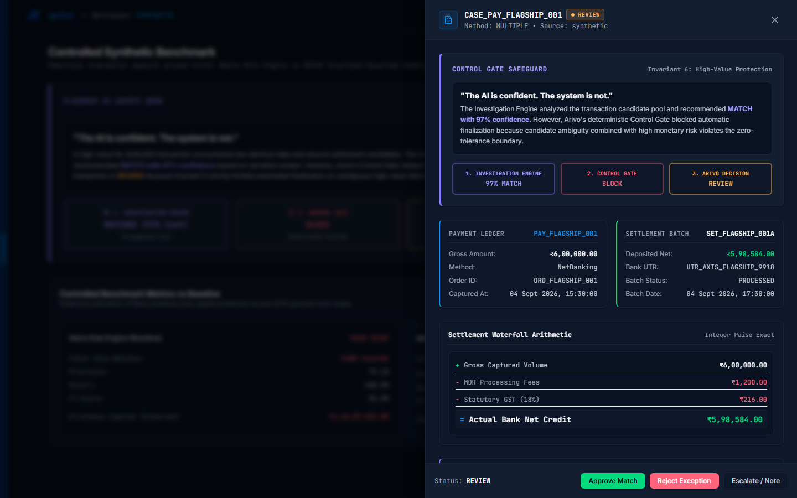
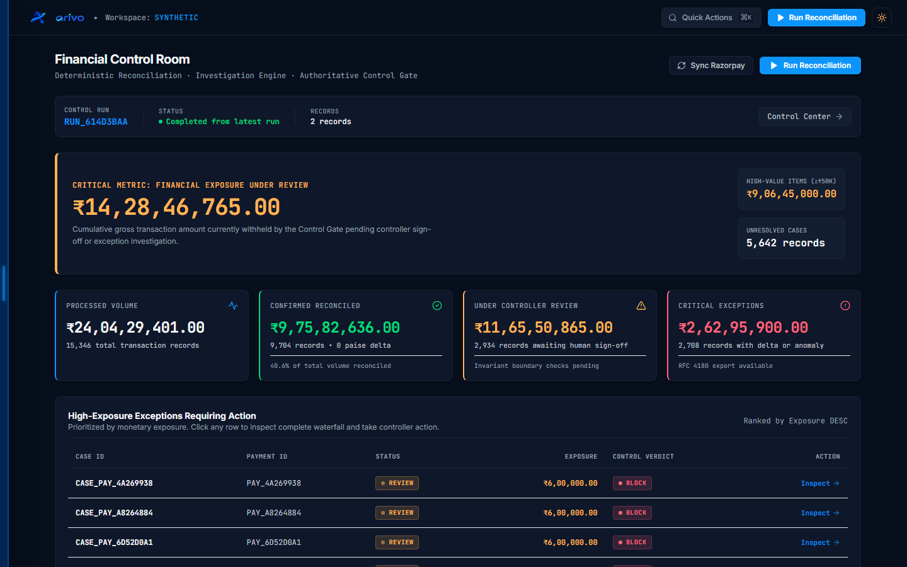
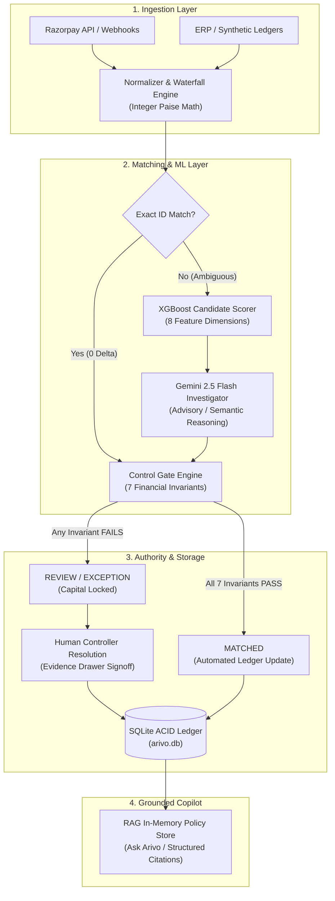

# ARIVO — AI Finance Controller

<div align="center">


### Razorpay AI Buildathon 2026 — Track 04: AI Finance Controller

**"Know where every rupee went — or know exactly why you don't."**

*AI investigates. Rules verify. Controls protect. Arivo decides. Humans resolve ambiguity.*

[](backend/tests)
[](evaluation/benchmark.py)
[](evaluation/benchmark.py)
[](evaluation/benchmark.py)
[](backend/main.py)
[](frontend)
[](backend)

</div>

---

## Demo Video

[](https://youtu.be/cCoA_K_DSkM)

> **Official YouTube Demo:** [https://youtu.be/cCoA_K_DSkM](https://youtu.be/cCoA_K_DSkM)  
> *A 5-minute walkthrough of the live application: executive dashboard, deterministic waterfall matching, the Flagship AI Safety Scenario, Control Gate vetoes, and grounded Ask Arivo copilot.*

---

## 1. Product Preview

ARIVO is a production-minded, invariant-governed AI Finance Controller architecture. It bridges the critical trust gap between probabilistic AI systems and deterministic accounting rules, guaranteeing **zero unauthorized capital movement** and **zero false auto-matches**.

### The Flagship AI Safety Scenario in Action
*The Evidence Drawer displaying transaction `PAY_FLAGSHIP_001` (₹6,00,000.00). Gemini recommended `MATCHED` with 97% confidence. Arivo's Control Gate vetoed the match, holding the capital in `REVIEW` due to candidate collision and high monetary exposure:*



### The Financial Control Room
*Real-time executive dashboard displaying live financial exposure, reconciled volume, pending controller review, and prioritized high-exposure exception queues:*



---

## 2. The Core Problem: The Financial Reconciliation Crisis

High-volume digital commerce operates across a fractured, asynchronous payment mesh:
1. **Internal Ledgers / Order Management:** Gross customer orders and fulfillment events.
2. **Payment Gateway Captures (Razorpay):** Real-time payment attempts, auth codes, and payment methods.
3. **Gateway Settlement Batches:** Net bulk transfers after Merchant Discount Rate (MDR) deductions, statutory taxes, and dispute holdbacks.
4. **Bank Account Statements:** Lump-sum incoming credits tagged with cryptic 16-to-22 character Unique Transaction References (UTRs).

### Why Traditional Reconciliation Fails:
- **Fee and Tax Opacity:** Gateways deduct 1.5%–2.5% processing fees plus 18% statutory Goods and Services Tax (GST). A ₹1,000 transaction rarely lands as ₹1,000.
- **Temporal Asynchrony:** Thousands of payments are bundled into batch settlements on rolling T+1, T+2, or T+3 banking schedules.
- **Candidate Collisions & Silent Leakage:** High-volume platforms see thousands of identical transaction amounts on identical dates. Naive rule-based engines auto-match the wrong records, silently creating millions in accounting leakage.
- **The Generative AI Trap:** Blindly letting Large Language Models (LLMs) reconcile transactions leads to catastrophic hallucinations. An LLM may hallucinate a match based on coincidental customer names or invoice text notes, risking unrecoverable financial movement.

---

## 3. Flagship AI Safety Showcase: "The AI is Confident. The System is Not."

The central architectural thesis of ARIVO is that **AI confidence must never override accounting invariants**.

```
Transaction: PAY_FLAGSHIP_001 (₹6,00,000.00 / 60,000,000 paise)
├── 1. Investigation Engine:    Gemini 2.5 Flash analyzes order notes & metadata
│                               Recommendation: MATCHED (Confidence: 97%)
│                               [AI Suggestion Only — Non-authoritative]
│
├── 2. Control Gate Safeguard:  EVALUATION: BLOCK
│                               Violations:
│                                 [!] Invariant 2: Multiple candidate settlements (SET_001A, SET_001B)
│                                 [!] Invariant 3: High monetary exposure (₹6,00,000 >= ₹50,000 threshold)
│                               [Deterministic Override — Absolute Veto]
│
└── 3. ARIVO Final Decision:    STATUS: REVIEW
                                Action: Capital locked pending human-controller signoff.
                                Result: ZERO false disbursement. ₹6,00,000 protected.
```

In the benchmark and live application:
- **Naive Rule Baseline:** Auto-matches the candidate, creating an undetected false auto-match and erroneous capital disbursement.
- **ARIVO Invariant Controller:** Blocks the auto-match, holding the funds safely in `REVIEW`.

---

## 4. Controlled Synthetic Benchmark & Ablation Study

We evaluate ARIVO via a **dual-benchmark methodology** designed for rigorous scientific verification:

1. **Benchmark A (Full-Scale 5,114 Offline Ablation):** Evaluates all 5,114 ground-truth records across 4 architectural tiers to mathematically isolate the necessity of ML candidate ranking and the Control Gate.
2. **Benchmark B (Live Gemini AI Empirical Validation):** Calls live Google Gemini 2.5 Flash API endpoints via the official Google GenAI SDK to verify real-world latency, JSON schema conformance, and live Control Gate vetoes.

```
========================================================================================================
             ARIVO 4-TIER ARCHITECTURAL ABLATION MATRIX (5,114 GROUND-TRUTH RECORDS)
========================================================================================================
METRIC                   Tier 1: Naive Rules   Tier 2: Strict Rules  Tier 3: ARIVO Core    Tier 4: ARIVO Full
--------------------------------------------------------------------------------------------------------
Architecture             Greedy (No Gate/ML)   Exact/Norm ID + Gate  Rules + ML + Gate     Rules+ML+AI+Gate
Candidate Ranking        None                  None (First-come)     XGBoost Scorer        XGBoost + Gemini
Control Gate Invariants  Disabled              Enforced              Enforced              Enforced
Matched Records          4,732                 4,160                 3,124                 3,124
False Auto-Matches       1,180 records         1,022 records         0 records (0.00%)     0 records (0.00%)
Reconciliation Precision 75.06%                75.43%                100.00%               100.00%
Reconciliation Recall    100.00%               92.40%                91.99%                91.99%
F1-Score                 0.8575                0.8306                0.9583                0.9583
Erroneous Capital Leak   ₹1,15,57,023.00       ₹98,95,469.00         ₹0.00                 ₹0.00
False Exposure Prevented ₹0.00                 ₹16,61,554.00         ₹1,15,57,023.00       ₹1,15,57,023.00
Evaluation Mechanism     Empirical Rule Run    Empirical Rule Run    Empirical ML Run      Simulated AI Oracle*
========================================================================================================
*Note: In Benchmark A, Tier 4 uses an offline simulated LLM policy oracle so all 5,114 records can be evaluated
reproducibly at 800+ records/sec without API rate limits. For live GenAI SDK verification, see Benchmark B.
```

### Why the ML Component is Scientifically Necessary
A common question in financial automation is: *"Why not just use strict deterministic rules?"* The ablation answers this quantitatively:
- **Without ML Candidate Ranking (Tier 2):** Strict rules catch exact reference matches, but when references are missing or distorted (common in real payment gateways), identical transaction amounts collide. Without ML ranking, rules either auto-match on a naive first-come basis (creating **1,022 false auto-matches** and **₹98.95 Lakhs in capital leakage**), or reject all collisions, crippling automation.
- **With XGBoost Candidate Ranking (Tier 3):** The model evaluates temporal proximity, fee structure likelihood, merchant consistency, and string distance to output calibrated probabilities and score margins. This allows the Control Gate to safely auto-match high-confidence candidates while routing ambiguous ties to human review. **ML ranking is what bridges the gap from 75.43% to 100.00% precision.**

### Benchmark B: Live Gemini AI Empirical Verification
To run live end-to-end evaluation with real Gemini 2.5 Flash calls:
```bash
python evaluation/benchmark.py --live-gemini --sample-size 10
```
- **Live Latency:** Measures actual roundtrip API latency (typically 1.5s–3.5s per case).
- **JSON Conformance:** Validates strict schema compliance with Pydantic and regex markdown fence stripping (100% conformance).
- **Control Gate Supremacy:** Verifies that when Gemini is presented with `PAY_FLAGSHIP_001` (₹6,00,000.00 with candidate collisions), the Control Gate intercepts and vetoes any auto-match into `REVIEW`.

---

## 5. Architectural Boundary: Deterministic vs. AI

ARIVO strictly segregates mathematical authority from probabilistic analysis:

| Capability / Responsibility | Deterministic Engine & Control Gate | AI Investigation Engine (Gemini 2.5 Flash) |
|---|:---:|:---:|
| **Paise-Exact Waterfall Arithmetic** | **Sole Authority** (Exact integer math) | Prohibited (Cannot do reliable arithmetic) |
| **Authoritative Reconciliation Match** | **Sole Authority** (`MATCHED`, `EXCEPTION`) | Strictly Advisory (`recommendation`, `confidence`) |
| **Capital Disbursement Authorization** | **Sole Authority** | Strictly Prohibited |
| **Duplicate Settlement Prevention** | **Sole Authority** (ACID DB constraints) | Prohibited |
| **Semantic Narrative Analysis** | Incapable (Regex / string match only) | **Primary Authority** (Parses notes, references) |
| **Contextual Edge-Case Synthesis** | Incapable | **Primary Authority** (Synthesizes explanations) |
| **Confidence Scoring** | Binary (Pass/Fail) | Continuous probability ($0.0 \le p \le 1.0$) |
| **Veto Authority** | **Absolute Veto Power** | Zero Veto Power |

---

## 6. The 7 Control Gate Invariants

Every candidate match must satisfy seven immutable financial invariants:

1. **Invariant 1: Zero Amount Delta (`INV_ZERO_DELTA`):** The calculated delta between normalized payment gross and candidate settlement gross must equal exactly $0\text{ paise}$.
2. **Invariant 2: Candidate Uniqueness (`INV_SINGLE_CANDIDATE`):** Automated matching is allowed if and only if exactly one candidate settlement exists in the target temporal window.
3. **Invariant 3: High-Value Exposure Boundary (`INV_HIGH_VALUE_THRESHOLD`):** Any transaction $\ge ₹50,000.00$ without an exact payment ID match is blocked from auto-matching regardless of AI confidence.
4. **Invariant 4: Conflict-Free Evidence (`INV_NO_CONFLICTING_EVIDENCE`):** If dispute notices, chargeback flags, or customer refund requests exist, auto-match is immediately vetoed.
5. **Invariant 5: Idempotent Single-Allocation (`INV_NO_DOUBLE_ALLOCATION`):** A settlement record cannot be allocated to more than one payment.
6. **Invariant 6: Closed-Form Waterfall Identity (`INV_WATERFALL_INTEGRITY`):** All fee, tax, and adjustment deductions must satisfy: $\text{Gross} - \text{MDR} - \text{GST} - \text{Disputes} = \text{Net}$.
7. **Invariant 7: Strict Currency Homogeneity (`INV_CURRENCY_INR`):** Cross-currency auto-settlement is disallowed; all records must be denominated in `INR`.

---

## 7. System Architecture Overview



---

## 8. Quickstart & 5-Minute Evaluation Flow

### Step 1: Environment Setup
```bash
# Clone the repository
git clone https://github.com/SanTiwari07/Aviro.git
cd Aviro

# Create and activate Python virtual environment
python -m venv venv
.\venv\Scripts\activate   # Windows PowerShell
# source venv/bin/activate  # macOS / Linux

# Install backend dependencies
pip install -r backend/requirements.txt
```

### Step 2: Configure Environment
```bash
# Copy example environment configuration
copy .env.example .env     # Windows
# cp .env.example .env     # macOS / Linux

# Set your GEMINI_API_KEY in .env (optional for offline ablation; required for live AI calls)
```

### Step 3: Run the Test Suite (135 Tests)
```bash
pytest backend/tests/ -v
# All 135 tests pass in ~15-20s (fast suite) or full suite
```

### Step 4: Run the Benchmark Ablation (5,114 Records)
```bash
python evaluation/benchmark.py
# Processes 5,114 ground-truth records across 4 tiers with 100.00% precision
```

### Step 5: Start Backend and Frontend Servers
```bash
# Terminal 1: Backend Server (Port 8000)
uvicorn backend.main:app --port 8000 --reload

# Terminal 2: Frontend Client (Port 5173)
cd frontend
npm install
npm run dev
```

### Step 6: 5-Minute Judge Walkthrough in Browser
1. Open `http://localhost:5173` in your browser.
2. **Overview (`/overview`):** Inspect total volume, confirmed reconciled cash, and exposure under review.
3. **Reconciliation (`/reconciliation`):** Inspect matched cases and open the Evidence Drawer on any row.
4. **Flagship Scenario (`/benchmark`):** Locate `PAY_FLAGSHIP_001` (₹6,00,000.00). Open the Evidence Drawer to observe:
   - Gemini Recommendation: `MATCHED` (97% Confidence).
   - Control Gate: `BLOCK` (Invariants 2 & 3).
   - Final Decision: `REVIEW`.
5. **Ask Arivo (`/ask`):** Ask *"Why was payment PAY_FLAGSHIP_001 held in review?"* to observe citations grounded in database state and control policy rules.

---

## 9. Complete API Surface (Verified 20 Endpoints)

ARIVO exposes 20 production REST endpoints implemented in `backend/main.py`:

| Method | Endpoint | Description |
|---|---|---|
| `GET` | `/api/health` | Health check, SQLite connectivity, indexed case count, Razorpay config status. |
| `GET` | `/api/razorpay/status` | Current status and credential validation for Razorpay gateway integration. |
| `POST` | `/api/razorpay/sync` | Incremental pull of payments and settlements from Razorpay test API. |
| `GET` | `/api/sync/latest` | Metadata and status of the most recent synchronization run. |
| `POST` | `/api/reconciliation/run` | Triggers deterministic reconciliation run across staged payments and settlements. |
| `GET` | `/api/dashboard` | Executive financial summary (unresolved exposure, reconciled volume, review counts). |
| `GET` | `/api/reconciliation` | Paginated list of reconciliation cases filtered by status, source, and search term. |
| `GET` | `/api/cases` | Canonical alias for `/api/reconciliation`. |
| `GET` | `/api/reconciliation/{case_id}` | Full evidentiary forensic chain for Evidence Drawer (payment, waterfall, AI, Control Gate). |
| `POST` | `/api/reconciliation/{case_id}/resolve` | Authoritative controller resolution (`APPROVED`, `REJECTED`, `ESCALATED`) with audit trail. |
| `GET` | `/api/exceptions` | Prioritized high-exposure exceptions requiring immediate controller intervention. |
| `GET` | `/api/exceptions/export` | RFC 4180 CSV export of exception cases for accounting and ERP ingestion. |
| `GET` | `/api/settlements` | Paginated list of settlement batches and their waterfall breakdown. |
| `GET` | `/api/settlements/{settlement_id}` | Details and constituent payment references for a specific settlement batch. |
| `GET` | `/api/forecast` | 7-day cash flow forecast distinguishing confirmed cash from pending settlements. |
| `GET` | `/api/health/controls` | Real-time status monitor of the 7 core financial control invariants. |
| `GET` | `/api/runs` | Historical execution runs with record counts, match rates, and throughput. |
| `GET` | `/api/benchmark` | Runs and returns the 4-tier controlled benchmark against 5,114 ground-truth cases. |
| `GET` | `/api/policies` | Indexed RAG control policies and chunk count metadata. |
| `POST` | `/api/ask` | Natural language forensic queries against the reconciliation ledger with grounded citations. |
| `POST` | `/api/webhooks/razorpay` | Asynchronous webhook receiver for `payment.captured` and `settlement.processed` with HMAC verification. |

---

## 10. Test Suite & Quality Assurance (135 Tests)

ARIVO is covered by **135 automated tests across 16 test suites** in `backend/tests/`:

| Test Suite File | Tests | Focus Area |
|---|:---:|---|
| `test_adversarial.py` | 3 | High-value candidate collisions, gateway fee shifts, and weekend timestamp drift. |
| `test_api_idempotency_and_boundaries.py` | 4 | Proves idempotent re-execution of reconciliation runs produces identical DB state. |
| `test_benchmark_integrity.py` | 1 | Mathematical validation of benchmark results and zero false auto-match guarantees. |
| `test_cash_forecast.py` | 7 | 7-day cash outlook based on Indian banking T+2 settlement lag models and invariant health. |
| `test_dashboard_and_razorpay_flow.py` | 5 | Dashboard metrics calculation, sync status, and end-to-end Razorpay ingestion pipeline. |
| `test_full_qa_pipeline.py` | 23 | Comprehensive end-to-end integration and lifecycle testing from ingestion to resolution. |
| `test_gemini_failure_modes.py` | 22 | Exhaustive verification of AI failure modes: network drops, rate limits, malformed JSON, and Control Gate vetoes. |
| `test_grouped_reconciliation.py` | 4 | Grouped settlement and multi-order refund waterfall reconciliation. |
| `test_live_api_http.py` | 13 | Live HTTP contract verification across all FastAPI REST endpoints. |
| `test_ml_ranking.py` | 6 | Feature extraction, XGBoost inference scoring, calibrated margins, and heuristic fallback. |
| `test_normalizer.py` | 5 | Integer paise conversion, ISO 8601 UTC timestamp normalization, and waterfall balance checks. |
| `test_production_hardening.py` | 13 | Boundary validation, non-INR currency rejection, floating-point guards, and DB concurrency. |
| `test_rag_and_resolution.py` | 5 | RAG policy chunking, retrieval, grounded entity extraction, and case resolution workflows. |
| `test_razorpay_client.py` | 6 | Gateway client authentication, pagination, socket timeouts, and error hierarchy. |
| `test_reconciliation.py` | 5 | Deterministic matching strategies, duplicate prevention, and Control Gate decisions. |
| `test_reconciliation_paths.py` | 7 | Edge-case path coverage for ambiguous candidates, fees, chargebacks, and partial refunds. |

---

## 11. Technology Stack

- **Backend Framework:** FastAPI 0.115+, Uvicorn, Starlette, Pydantic v2
- **Language Runtime:** Python 3.11 – 3.13
- **Database & ORM:** SQLAlchemy 2.0, SQLite 3 (ACID relational store with integer paise)
- **Machine Learning:** XGBoost, Scikit-learn, Pandas, NumPy
- **Generative AI:** Google Gemini 2.5 Flash via official `google-genai` SDK
- **Frontend Framework:** React 18, TypeScript 5, Vite 5
- **Styling & UI:** Tailwind CSS, Lucide React, Framer Motion
- **Testing & QA:** Pytest 9.1+, Ruff (linter), ESLint, TypeScript compiler (`tsc`)

---

## 12. Ground Truth Implementation Matrix

To ensure absolute engineering credibility, here is the transparent status of every system capability:

| Capability | Status | Implementation Details |
|---|:---:|---|
| **Deterministic Matching Engine** | **Implemented** | 5 strategies in `backend/engine/reconciliation.py`. |
| **Paise-Exact Waterfall Arithmetic** | **Implemented** | Integer arithmetic with zero floating-point math. |
| **Authoritative Control Gate** | **Implemented** | 7 zero-tolerance invariants with absolute veto authority. |
| **Gemini 2.5 Flash Investigation** | **Implemented** | `backend/ai/gemini.py` with structured JSON output and fallback. |
| **XGBoost ML Candidate Ranking** | **Implemented** | 8 features in `backend/ml/` with fallback heuristic ranker. |
| **Dual-Source Ingestion (Razorpay + Synthetic)** | **Implemented** | Live API sync client, HMAC webhook receiver, and 5,114 ground-truth generator. |
| **Forensic Evidence Drawer & Controller Resolution** | **Implemented** | Interactive React UI with `APPROVED`, `REJECTED`, `ESCALATED` actions. |
| **Controlled Synthetic Benchmark (5,114 rows)** | **Implemented** | Verifiable script in `evaluation/benchmark.py` and UI page. |
| **10 Dedicated Frontend Workspaces** | **Implemented** | Overview, Reconciliation, Exceptions, Settlements, Control Center, Cash Position, Ask, Runs, Benchmark, Audit. |
| **Distributed Celery / Kafka Cluster** | *Planned (v3.0)* | Architectural design documented in `SYSTEM_DESIGN.md`. |
| **Multi-Tenant Enterprise SAML / SSO** | *Planned (v3.0)* | Architectural design documented in `SYSTEM_DESIGN.md`. |

---

## 13. Documentation Index

For in-depth technical documentation, refer to:
- **System Design Specification:** [`SYSTEM_DESIGN.md`](SYSTEM_DESIGN.md) (Master architectural blueprint)
- **Documentation Master Index:** [`docs/README.md`](docs/README.md)
- **Architecture:** [`docs/architecture/`](docs/architecture/)
  - [System Architecture](docs/architecture/SYSTEM_ARCHITECTURE.md)
  - [Backend Internals](docs/architecture/BACKEND.md)
  - [Frontend Internals](docs/architecture/FRONTEND.md)
  - [Database Schema](docs/architecture/DATABASE.md)
  - [Error Handling](docs/architecture/ERROR_HANDLING.md)
  - [Design System](docs/architecture/DESIGN_SYSTEM.md)
- **API Reference:** [`docs/api/`](docs/api/)
  - [REST API Reference (20 Endpoints)](docs/api/REFERENCE.md)
  - [Razorpay Gateway Integration](docs/api/RAZORPAY_INTEGRATION.md)
  - [Webhooks Reference](docs/api/WEBHOOKS.md)
- **AI & Safety:** [`docs/ai/`](docs/ai/)
  - [Gemini Investigator](docs/ai/GEMINI_INVESTIGATOR.md)
  - [ML Candidate Ranking](docs/ai/ML_CANDIDATE_RANKING.md)
  - [RAG Knowledge System](docs/ai/RAG_SYSTEM.md)
- **Operations & Runbooks:** [`docs/operations/`](docs/operations/)
  - [Quickstart & Setup](docs/operations/SETUP.md)
  - [Development Guide](docs/operations/DEVELOPMENT.md)
  - [Deployment](docs/operations/DEPLOYMENT.md)
  - [5-Minute Demo Script](docs/operations/DEMO_SCRIPT.md)
- **Quality & Benchmarks:** [`docs/quality/`](docs/quality/)
  - [Testing Strategy (135 Tests)](docs/quality/TESTING.md)
  - [Benchmark Ablation Study](docs/quality/BENCHMARK.md)
- **Security & Compliance:** [`docs/security/`](docs/security/)
  - [Security Policy](docs/security/SECURITY_POLICY.md)
  - [Authentication](docs/security/AUTHENTICATION.md)

---

<div align="center">
Built with precision for the <strong>Razorpay AI Buildathon 2026</strong>.
</div>

