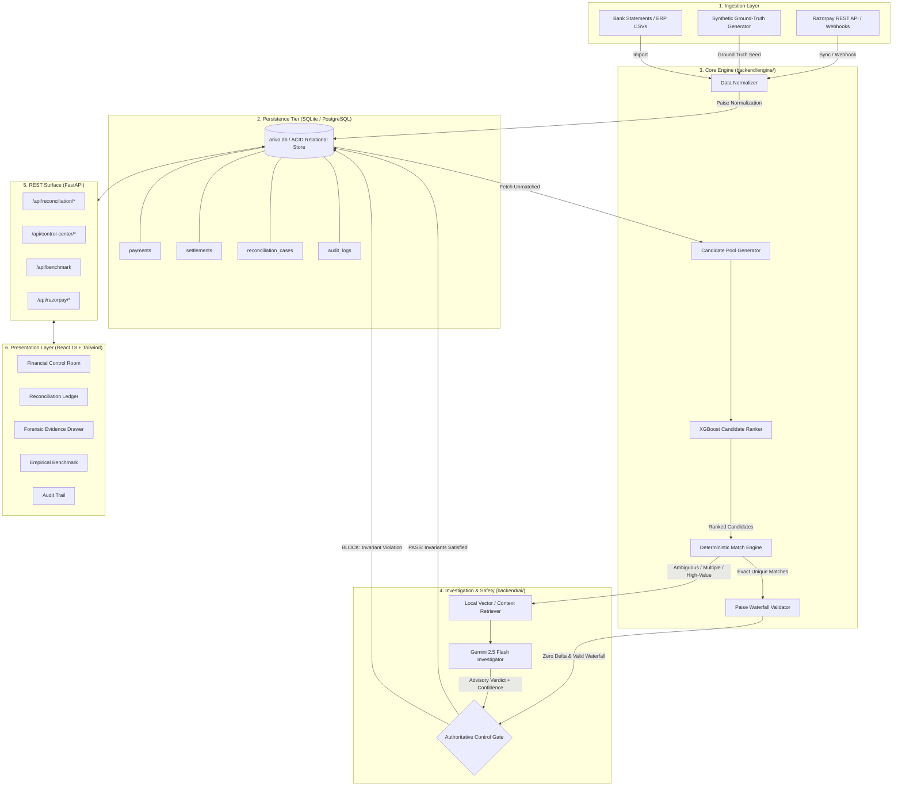
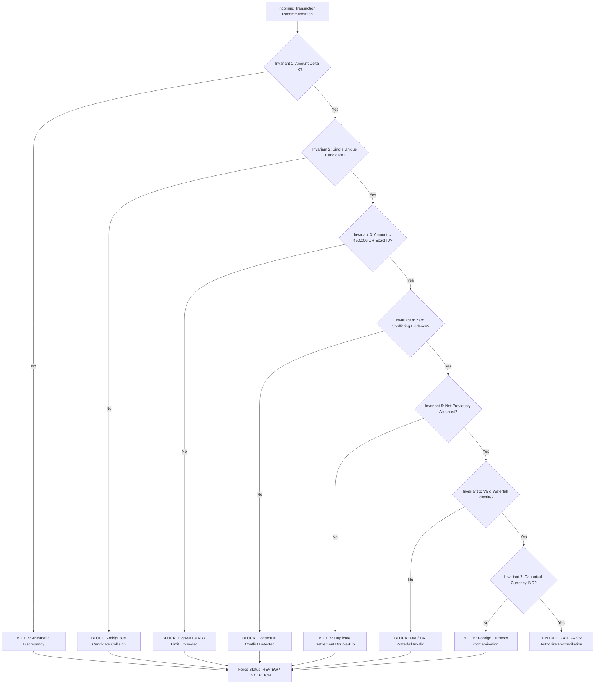
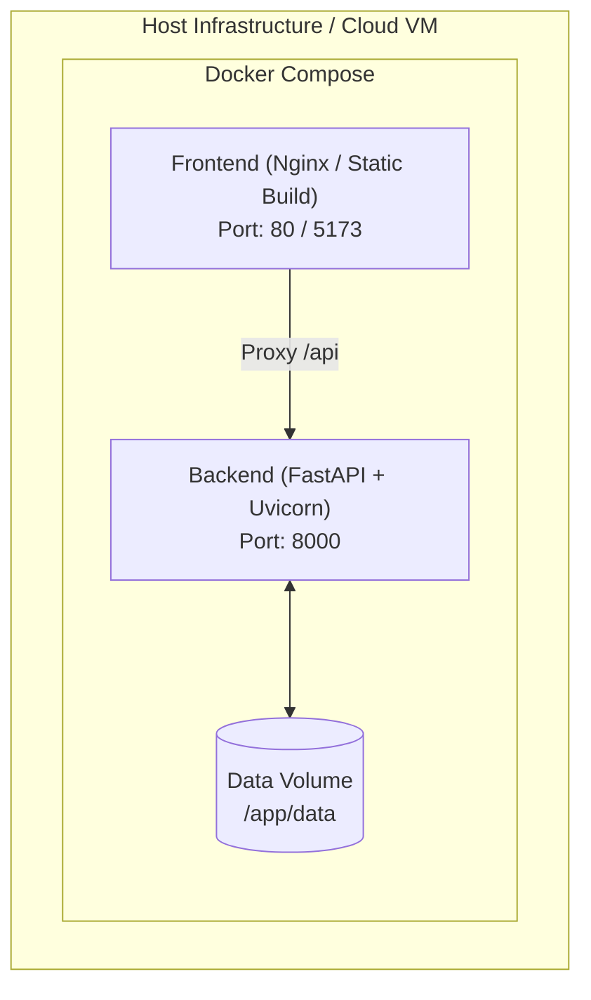

# ARIVO System Design & Architecture Specification

> **Positioning:** *"Know where every rupee went — or know exactly why you don't."*  
> **Core Principle:** *"AI investigates. Rules verify. Controls protect. Arivo decides. Humans resolve ambiguity."*  
> **Target:** Razorpay AI Buildathon 2026 — Track 04: AI Finance Controller  
> **Version:** 2.0.0 (Production Architecture Specification)

---

## Table of Contents

1. [Overview & Problem Statement](#1-overview--problem-statement)
2. [Design Philosophy & Core Axioms](#2-design-philosophy--core-axioms)
3. [High-Level Architecture](#3-high-level-architecture)
4. [Component Responsibilities](#4-component-responsibilities)
5. [End-to-End Reconciliation Pipeline](#5-end-to-end-reconciliation-pipeline)
6. [Deterministic vs. AI Architectural Boundary](#6-deterministic-vs-ai-architectural-boundary)
7. [Reconciliation Matching Engine & Strategies](#7-reconciliation-matching-engine--strategies)
8. [Settlement Waterfall & Paise-Exact Arithmetic](#8-settlement-waterfall--paise-exact-arithmetic)
9. [The Authoritative Control Gate & Financial Invariants](#9-the-authoritative-control-gate--financial-invariants)
10. [AI Investigation Engine (Gemini 2.5 Flash)](#10-ai-investigation-engine-gemini-25-flash)
11. [ML Candidate Ranking Pipeline (XGBoost)](#11-ml-candidate-ranking-pipeline-xgboost)
12. [Data Ingestion & Payment Gateway Integration](#12-data-ingestion--payment-gateway-integration)
13. [Database Schema & Persistence Model](#13-database-schema--persistence-model)
14. [Security, Zero-Trust Credentials & Auditing](#14-security-zero-trust-credentials--auditing)
15. [Observability, Metrics & Forensic Tracing](#15-observability-metrics--forensic-tracing)
16. [Error Handling, Fault Tolerance & Failure Modes](#16-error-handling-fault-tolerance--failure-modes)
17. [Performance Benchmarks & Scaling Characteristics](#17-performance-benchmarks--scaling-characteristics)
18. [Indian Financial System & Gateway Realities](#18-indian-financial-system--gateway-realities)
19. [Containerization & Deployment Architecture](#19-deployment-architecture)
20. [Production Evolution & Technical Roadmap](#20-production-evolution--technical-roadmap)

---

## 1. Overview & Problem Statement

Modern digital commerce runs on an asynchronous, highly distributed, multi-party financial mesh. A single consumer transaction traverses a customer application, a payment gateway (e.g., Razorpay), card networks (Visa/Mastercard/RuPay) or the NPCI (UPI), acquiring banks, issuing banks, and nodal escrow settlement accounts before ultimately landing in a merchant's corporate bank account.

Along this journey, financial records fragment into disparate systems:
1. **Order Management / Internal Ledgers:** Records gross customer commitments and internal SKU fulfillment.
2. **Gateway Captured Payments:** Records real-time payment attempts, auth codes, and payment methods.
3. **Gateway Settlement Batches:** Records net bulk transfers after Merchant Discount Rate (MDR) deductions, statutory taxes, and dispute holdbacks.
4. **Bank Account Statements (NEFT/RTGS/IMPS):** Records lump-sum incoming credits tagged with cryptic 16-to-22 character Unique Transaction References (UTRs).

### The Reconciliation Crisis
Traditional finance teams manually reconcile these datasets using spreadsheets or rigid rule scripts. This approach suffers from fatal structural flaws:
- **Fee and Tax Opacity:** Gateways deduct variable processing fees (e.g., 2% MDR) plus 18% statutory GST. A ₹1,000 transaction rarely lands as ₹1,000.
- **Batching & Timing Asynchrony:** Thousands of payments are bundled into single batch settlement transfers on variable T+1, T+2, or T+3 rolling schedules.
- **Ambiguity & False Auto-Matching:** High-volume platforms see thousands of identical transaction amounts on identical dates. Naive rule-based engines auto-match the wrong records, silently creating unrecoverable accounting leakage.
- **The Generative AI Trap:** Blindly applying Large Language Models (LLMs) to financial settlement creates catastrophic hallucinations. An LLM may hallucinate a match based on coincidental customer names or invoice text notes, risking millions in misallocated capital.

### The ARIVO Solution
**ARIVO** is an autonomous, invariant-governed AI Finance Controller designed specifically to solve financial reconciliation without compromising financial safety. ARIVO combines:
- Deterministic, paise-exact waterfall arithmetic.
- Gradient-boosted machine learning candidate ranking (XGBoost).
- Deep semantic reasoning via Google Gemini 2.5 Flash for ambiguous cases.
- An immutable, authoritative **Control Gate** that enforces 7 zero-tolerance financial invariants.

In ARIVO, **AI is never permitted to move money or declare an authoritative reconciliation match.** AI investigates ambiguity and gathers evidence; deterministic rules verify mathematics; the Control Gate protects capital; and human finance controllers maintain final supervisory authority.

---

## 2. Design Philosophy & Core Axioms

```
   ┌─────────────────────────────────────────────────────────────┐
   │                       ARIVO TAXONOMY                        │
   │                                                             │
   │   1. AI Investigates       ──  Semantic contextual analysis │
   │   2. Rules Verify          ──  Exact integer mathematics    │
   │   3. Controls Protect      ──  Invariant enforcement        │
   │   4. Arivo Decides         ──  Deterministic state machine  │
   │   5. Humans Supervise      ──  Authority over ambiguity     │
   └─────────────────────────────────────────────────────────────┘
```

ARIVO is built on five non-negotiable architectural axioms:

### Axiom 1: Integer-Only Minor Currency Units (Paise-Exact)
Floating-point numbers (`float`, `double`) are strictly prohibited in all financial paths. IEEE 754 representation issues introduce rounding drift (e.g., `0.1 + 0.2 = 0.30000000000000004`). In ARIVO:
- All transaction values, fees, taxes, refunds, and adjustments are stored and computed as signed 64-bit integers representing **Indian Paise** (1 INR = 100 Paise).
- Rupee values are generated strictly at the UI presentation boundary.

### Axiom 2: Separation of Investigation and Decision Authority
Generative AI and statistical models are treated as **untrusted analytical advisors**. They can parse unstructured logs, compare contextual metadata, compute similarity scores, and synthesize forensic explanations. They can **never** set the authoritative status of a financial record to `MATCHED`. Only deterministic validation that passes all Control Gate invariants can finalize a reconciliation.

### Axiom 3: The Flagship Safety Invariant ("The AI is confident. The system is not.")
When an AI model expresses high confidence (e.g., 97% or 99%) in an ambiguous match, but deterministic invariants identify conflicting candidates or unverified high monetary exposure, **the Control Gate must veto the AI**. The system halts automatic execution, locks the funds in `REVIEW`, and forces a four-eyes human controller audit.

### Axiom 4: Idempotency Across All Layers
Reconciliation runs, data sync operations, and webhook deliveries must be fully idempotent. Re-running a batch reconciliation on identical or overlapping records must produce identical state without double-allocating settlements or duplicating audit logs.

### Axiom 5: Complete Evidentiary Audit Trails
Every reconciliation state transition must produce an immutable audit snapshot. The system preserves the exact candidate pool, ML feature scores, raw Gemini prompt/response payloads, Control Gate rule evaluations, and the authenticated human controller ID.

---

## 3. High-Level Architecture

The ARIVO platform follows a modern, decoupled architecture separating the presentation layer, the API and orchestration gateway, the deterministic computation engine, the AI investigation pipeline, and the persistence tier.



---

## 4. Component Responsibilities

| Component | Repository Path | Primary Responsibility | Failure Recovery / Boundary |
|---|---|---|---|
| **FastAPI Gateway** | `backend/main.py` | Exposes 20 REST endpoints, CORS policies, request validation, transaction session management. | Returns structured RFC 7807 error envelopes; handles unhandled exceptions safely. |
| **Normalizer** | `backend/integrations/razorpay/normalizer.py` | Converts external heterogeneous payloads into canonical integer paise representations. | Rejects records with negative amounts or missing currencies. |
| **Reconciliation Engine** | `backend/engine/reconciliation.py` | Coordinates candidate matching, waterfall arithmetic verification, and status classification. | Pure functional calculations; rolls back DB transactions on database error. |
| **Settlement Waterfall** | `backend/engine/reconciliation.py` | Verifies integer mathematical identity: $\text{Gross} - \text{Fees} - \text{Tax} - \text{Refunds} - \text{Chargebacks} + \text{Adjustments} = \text{Net}$. | Emits `DELTA_MISMATCH` exception if difference is non-zero. |
| **ML Candidate Ranker** | `backend/ml/` | Ranks candidate settlement matches using an 8-feature XGBoost model trained on historic patterns. | Fallbacks gracefully to deterministic heuristic ranking if model file is missing. |
| **Gemini Investigator** | `backend/ai/gemini.py` | Investigates high-value, ambiguous, or multi-candidate records using Google Gemini 2.5 Flash. | Strict timeout (15s); structured JSON validation; falls back to deterministic rule engine if API fails. |
| **Control Gate** | `backend/engine/reconciliation.py` | Evaluates 7 zero-tolerance financial invariants against deterministic and AI recommendations. | Absolute veto power: If gate outputs `BLOCK`, status is locked in `REVIEW` or `EXCEPTION`. |
| **Database Tier** | `backend/database.py` | Relational storage for transactions, settlement batches, cases, and forensic logs. | Foreign keys, unique constraints on `case_id`, transactional commits. |
| **Synthetic Dataset** | `dataset/generate_dataset.py` | Generates 5,114 ground-truth records across 6 adversarial business scenarios. | Fully deterministic via fixed random seed (`20260902`). |
| **Frontend SPA** | `frontend/src/` | High-density operational workspace for human controllers (Dark/Light Mode, Evidence Drawer). | Read-only presentation; actions require explicit controller token confirmation. |

---

## 5. End-to-End Reconciliation Pipeline

The reconciliation process follows an 11-step pipeline designed to prevent data leakage and eliminate race conditions:

```
Step 1: Data Ingestion & Batch Loading
   │    Fetch raw payments and settlements from gateway sync or database staging.
   ▼
Step 2: Canonical Normalization
   │    Transform amounts to integer paise, standardize timestamps to UTC ISO-8601.
   ▼
Step 3: Candidate Pool Generation
   │    Index settlements by date windows (T-0 to T+3), currency (INR), and status.
   ▼
Step 4: Machine Learning Candidate Scoring
   │    Compute 8 feature vectors per candidate pair; run XGBoost inference for match probability.
   ▼
Step 5: Deterministic Exact Matching
   │    Check for unique 1-to-1 matches with exact Payment ID, Order ID, or UTR references.
   ▼
Step 6: Settlement Waterfall Arithmetic Verification
   │    Assert Gross - MDR - GST - Disputes = Expected Net == Actual Bank Net (0 paise delta).
   ▼
Step 7: Ambiguity & Anomaly Detection
   │    Flag multi-candidate collisions, amount deltas, or high monetary risk (> ₹50,000).
   ▼
Step 8: Contextual RAG Assembly & Retrieval
   │    Extract relevant dispute policies, merchant agreements, and historic settlement patterns.
   ▼
Step 9: Gemini 2.5 Flash Semantic Investigation
   │    Prompt LLM with full context; receive structured JSON analysis with confidence score.
   ▼
Step 10: Authoritative Control Gate Invariant Evaluation
   │    Run the 7 financial invariants against the transaction. Gate issues PASS or BLOCK.
   ▼
Step 11: Transactional Persistence & Forensic Audit Logging
        Commit final status (MATCHED, REVIEW, EXCEPTION), record full audit trail, notify UI.
```

---

## 6. Deterministic vs. AI Architectural Boundary

A foundational architectural requirement in ARIVO is an uncompromising separation of concerns between deterministic algorithms and AI models.

| Capability / Concern | Deterministic Engine & Control Gate | AI Investigation Engine (Gemini 2.5 Flash) |
|---|:---:|:---:|
| **Paise Math & Waterfall Verification** | **Sole Authority** (Exact integer math) | Prohibited (Cannot do reliable arithmetic) |
| **Authoritative Matching Decision** | **Sole Authority** (`MATCHED`, `EXCEPTION`) | Strictly Advisory (`recommendation`, `confidence`) |
| **Capital Disbursement Approval** | **Sole Authority** | Strictly Prohibited |
| **Duplicate Settlement Allocation Prevention** | **Sole Authority** (Unique DB constraints) | No visibility into global transactional locks |
| **Semantic Narrative Analysis** | Incapable (Regex / string match only) | **Primary Authority** (Parses notes, references) |
| **Contextual Edge-Case Synthesis** | Incapable | **Primary Authority** (Synthesizes human explanations) |
| **Confidence Scoring** | Binary (Pass/Fail) | Continuous probability ($0.0 \le p \le 1.0$) |
| **Veto Power** | **Absolute Veto Authority** | Zero Veto Authority |

---

## 7. Reconciliation Matching Engine & Strategies

ARIVO's matching engine (`backend/engine/reconciliation.py`) implements five distinct matching strategies executed in order of precedence:

### 1. `EXACT_ID` (Highest Confidence — Deterministic)
- Matches payment record to settlement batch where `payment.payment_id == settlement.payment_id` or `payment.order_id == settlement.order_id`.
- Validates that amount delta is exactly 0 paise.
- **Classification:** Auto-resolves to `MATCHED` if Control Gate passes.

### 2. `AMOUNT_TIMESTAMP` (Single Candidate — Deterministic)
- Applied when unique ID is missing or masked.
- Searches candidate window: settlement timestamp $\in [T_{\text{payment}}, T_{\text{payment}} + 72\text{ hours}]$.
- Requires **exactly one** candidate settlement batch with identical gross amount.
- **Classification:** Auto-resolves to `MATCHED` only if amount $< ₹50,000$ (Paise $< 5,000,000$). High-value matches are held for review.

### 3. `ML_FALLBACK` (Probabilistic Candidate Scoring)
- Triggered when multiple potential settlement records match amount criteria.
- Uses XGBoost inference across feature vectors (amount similarity, timestamp delta, fee ratio, description similarity).
- Produces a ranked candidate list. If top score exceeds $0.85$ and second candidate is $< 0.50$, proposed for investigation.

### 4. `MULTIPLE` (Ambiguity Collision — AI Assisted)
- Occurs when two or more distinct settlements match identical amount and date ranges without unique identifiers.
- Triggers Gemini 2.5 Flash semantic investigation.
- **Classification:** Regardless of AI confidence, the Control Gate holds the transaction in `REVIEW`.

### 5. `UNMATCHED` (Exception State)
- No candidate settlements exist within the allowable $T+3$ temporal window, or gross amount deltas cannot be reconciled.
- **Classification:** Flagged as `EXCEPTION` for human investigation and gateway dispute filing.

---

## 8. Settlement Waterfall & Paise-Exact Arithmetic

Payment reconciliation is not a simple comparison of gross figures. For every captured payment, the settlement waterfall establishes an unbroken chain of custody:

$$\text{Gross Captured Volume} - \text{MDR Gateway Fees} - \text{Statutory GST (18\%)} - \text{Refunds} - \text{Dispute Holdbacks} + \text{Adjustments} = \text{Expected Net}$$

$$\text{Unexplained Delta} = |\text{Expected Net} - \text{Actual Bank Net Credit}|$$

```
   ┌─────────────────────────────────────────────────────────────────┐
   │                  SETTLEMENT WATERFALL BREAKDOWN                 │
   │                                                                 │
   │   Gross Payment Volume                     ₹6,00,000.00         │
   │   (-) MDR Processing Fee (2.0%)            - ₹1,200.00          │
   │   (-) Statutory GST on Fee (18.0%)             - ₹216.00         │
   │   (-) Customer Refunds Authorized                ₹0.00          │
   │   (-) Chargeback Withholding Reserves            ₹0.00          │
   │   (+) Escrow Adjustments                         ₹0.00          │
   │   ───────────────────────────────────────────────────────────   │
   │   (=) Expected Net Settlement              ₹5,98,584.00         │
   │   (=) Actual Bank Credit (UTR AXIS)        ₹5,98,584.00         │
   │   ───────────────────────────────────────────────────────────   │
   │   UNEXPLAINED ARITHMETIC DELTA:                   ₹0.00 (0 ps)  │
   └─────────────────────────────────────────────────────────────────┘
```

### Invariant Guarantee:
If $\text{Unexplained Delta} \neq 0\text{ paise}$, the reconciliation engine triggers an automatic invariant failure:
- Match method is overridden to `EXCEPTION`.
- Case is tagged with error code `ERR_WATERFALL_MISMATCH`.
- Transaction cannot be marked `MATCHED` under any circumstance.

---

## 9. The Authoritative Control Gate & Financial Invariants

The **Control Gate** is the supreme safety layer in ARIVO. It enforces 7 non-negotiable financial invariants. If **any** invariant fails, the gate outputs a `BLOCK` verdict, superseding any ML score or AI recommendation.



### The 7 Control Gate Invariants

1. **Invariant 1: Zero Amount Delta (`INV_ZERO_DELTA`)**
   - The computed difference between normalized payment gross and candidate settlement gross must equal exactly $0\text{ paise}$.
2. **Invariant 2: Candidate Uniqueness (`INV_SINGLE_CANDIDATE`)**
   - Automated matching is permitted if and only if exactly one candidate settlement exists in the target temporal window. Multiple candidate matches require human sign-off.
3. **Invariant 3: High-Value Exposure Boundary (`INV_HIGH_VALUE_THRESHOLD`)**
   - Any transaction with gross amount $\ge ₹50,000.00$ ($5,000,000\text{ paise}$) without an exact payment ID match is blocked from auto-matching, even if ML or AI confidence is 100%.
4. **Invariant 4: Conflict-Free Evidence (`INV_NO_CONFLICTING_EVIDENCE`)**
   - If dispute notices, chargeback flags, or customer support refund requests are associated with the payment, auto-match is immediately vetoed.
5. **Invariant 5: Idempotent Single-Allocation (`INV_NO_DOUBLE_ALLOCATION`)**
   - A settlement record cannot be allocated to more than one payment. DB-level foreign key and unique constraint checks guarantee single-allocation.
6. **Invariant 6: Closed-Form Waterfall Identity (`INV_WATERFALL_INTEGRITY`)**
   - All fee, tax, and adjustment deductions must satisfy the exact integer arithmetic equation with zero remainder.
7. **Invariant 7: Strict Currency Homogeneity (`INV_CURRENCY_INR`)**
   - Cross-currency auto-settlement is disallowed. All entities must be denominated in `INR`.

### The Flagship Safety Scenario: "The AI is Confident. The System is Not."
- **Scenario:** High-value enterprise payment of **₹6,00,000.00** (`PAY_FLAGSHIP_001`).
- **Condition:** Two identical settlement records (`SET_FLAGSHIP_001A` and `SET_FLAGSHIP_001B`) exist on the same date with identical net amounts.
- **AI Action:** Gemini 2.5 Flash investigates narrative order notes, finds semantic overlap with batch A, and recommends `MATCHED` with **97% confidence**.
- **Control Gate Action:** Invariant 2 (Multiple Candidates) and Invariant 3 (High-Value Threshold) trigger an immediate **BLOCK**.
- **System Outcome:** Final status is forced to `REVIEW`. Zero paise are erroneously disbursed. The controller reviews the forensic drawer and resolves the ambiguity manually.

---

## 10. AI Investigation Engine (Gemini 2.5 Flash)

ARIVO integrates Google's **Gemini 2.5 Flash** model via the official `google-genai` SDK (`backend/ai/gemini.py`).

### Prompt Engineering & Structured Output
The prompt enforces strict analytical constraints and mandates a JSON schema response:

```python
INVESTIGATION_SCHEMA = {
    "recommendation": "MATCHED" | "EXCEPTION" | "MANUAL_REVIEW",
    "confidence": float,  # 0.0 to 1.0
    "supporting_evidence": list[str],
    "identified_risks": list[str],
    "settlement_analysis": str,
    "discrepancy_explanation": str
}
```

### Deterministic Fallback Mode
If the Gemini API encounters a network timeout ($> 15\text{s}$), rate limiting (HTTP 429), or missing API credentials, ARIVO activates the **Deterministic Fallback Engine**:
- Evaluates candidate metadata using deterministic Levenshtein distance and timestamp proximity.
- Tags the case with `ai_investigation.used = false` and `fallback_mode = true`.
- Demotes confidence to safe heuristic levels ($\le 0.70$).
- Ensures system availability never halts due to an external AI outage.

---

## 11. ML Candidate Ranking Pipeline (XGBoost)

Before invoking expensive LLM calls, ARIVO ranks settlement candidates using an **XGBoost 3.4.1** gradient-boosted decision tree pipeline (`backend/ml/` and `scripts/train_ml_model.py`).

### Feature Vector Formulation (8 Features)
1. `amount_delta_paise`: Absolute difference in gross transaction value.
2. `timestamp_delta_hours`: Difference between payment creation and settlement batch time.
3. `fee_ratio`: Ratio of gateway processing fee to gross amount.
4. `tax_ratio`: Ratio of statutory GST to gateway processing fee (expected $\approx 0.18$).
5. `id_token_overlap`: Jaccard similarity of alphanumeric tokens in order references.
6. `method_match`: Binary flag indicating matching payment method (e.g., UPI, Card, NetBanking).
7. `historical_merchant_settlement_count`: Volume of previous successful settlements for the merchant.
8. `day_of_week_dispersion`: Cyclic encoding of day-of-week timing offsets.

### Cold-Start Fallback
If the trained XGBoost model artifact (`arivo_ml_model/`) is unavailable in a fresh deployment, the system falls back to a deterministic candidate scoring function based on weighted Euclidean distance across normalized feature vectors.

---

## 12. Data Ingestion & Payment Gateway Integration

ARIVO supports dual-mode ingestion: direct API synchronization with payment gateways (Razorpay) and deterministic synthetic dataset ingestion.

```mermaid
flowchart LR
    subgraph Gateway["Payment Gateway (Razorpay)"]
        API_PAY["GET /v1/payments"]
        API_SET["GET /v1/settlements"]
        WH["Webhooks (payment.captured, settlement.processed)"]
    end

    subgraph ARIVO_Ingest["ARIVO Ingestion Engine"]
        CLIENT["RazorpaySyncService"]
        HMAC["HMAC-SHA256 Signature Validator"]
        NORM["Canonical Normalizer"]
    end

    subgraph Persistence["Storage Tier"]
        DB[(arivo.db)]
    end

    API_PAY --> CLIENT
    API_SET --> CLIENT
    CLIENT --> NORM
    WH --> HMAC --> NORM
    NORM -->|Upsert (Idempotent)| DB
```

### Ingestion Modules:
- **`backend/integrations/razorpay/client.py`**: Wrapper for Razorpay REST APIs with automatic pagination, exponential backoff, and rate-limit backoff.
- **`backend/integrations/razorpay/normalizer.py`**: Translates gateway JSON schemas into internal canonical models, enforcing integer paise conversions.
- **`backend/integrations/razorpay/sync.py`**: Batch synchronization service with deduplication and incremental cursor tracking.
- **Webhook Idempotency**: Webhook events are verified using HMAC-SHA256 signatures (`X-Razorpay-Signature`). Event IDs are recorded in the database to prevent duplicate processing of replayed webhooks.

---

## 13. Database Schema & Persistence Model

ARIVO uses an ACID-compliant relational schema implemented via SQLAlchemy 2.0 (`backend/database.py`).

### Relational Entity Model

```
   ┌──────────────────────┐          ┌──────────────────────┐
   │       payments       │          │     settlements      │
   ├──────────────────────┤          ├──────────────────────┤
   │ PK payment_id        │          │ PK settlement_id     │
   │    order_id          │          │    gross_amount (int)│
   │    amount (int paise)│          │    fees (int paise)  │
   │    fee (int paise)   │          │    tax (int paise)   │
   │    tax (int paise)   │          │    net_amount (int)  │
   │    currency (INR)    │          │    utr               │
   │    method            │          │    status            │
   │    captured_at       │          │    settled_at        │
   └──────────┬───────────┘          └──────────┬───────────┘
              │                                 │
              │       ┌──────────────────┐      │
              └──────>│  reconciliation  │<─────┘
                      │      _cases      │
                      ├──────────────────┤
                      │ PK case_id       │
                      │ FK payment_id    │
                      │ FK settlement_id │
                      │    status        │
                      │    match_method  │
                      │    amount_delta  │
                      │    control_status│
                      │    ai_summary    │
                      │    resolved_by   │
                      │    resolved_at   │
                      └──────────────────┘
```

### Dynamic SQLite Migration Invariant
To ensure seamless deployments without external migration managers, `backend/database.py` executes `_ensure_sqlite_columns()` on startup, dynamically inspecting tables via SQLite `PRAGMA table_info()` and applying additive non-destructive `ALTER TABLE` migrations.

---

## 14. Security, Zero-Trust Credentials & Auditing

ARIVO follows security best practices tailored for financial control software:

1. **Zero Secret Hardcoding:** API keys (Razorpay Key ID/Secret, Gemini API Key) are strictly injected via environment variables. The repository includes a sanitized `.env.example`.
2. **Read-Only Ingestion Permissions:** Gateway API credentials require only read permissions (`payments:read`, `settlements:read`). ARIVO never requests fund-transfer permissions.
3. **Database File Protection:** The local database (`arivo.db`) and all SQLite database files (`*.db`) are strictly excluded in `.gitignore` to prevent committing live transaction records.
4. **CORS Boundary:** The FastAPI backend restricts Cross-Origin Resource Sharing (CORS) to designated local frontend origins (`http://localhost:5173`, `http://127.0.0.1:5173`) and configurable production domains.
5. **Immutable Controller Audit Logs:** Every manual resolution action records the controller username, timestamp, resolution action (`APPROVED`, `REJECTED`, `ESCALATED`), and supervisory audit notes.

---

## 15. Observability, Metrics & Forensic Tracing

Every reconciliation run emits structured telemetry capturing operational and business metrics:

- **Processed Volume (Paise & INR):** Total cumulative transaction volume evaluated.
- **Reconciliation Rate (%):** Percentage of payments successfully resolved with zero delta.
- **Capital Exposure Under Review (Paise & INR):** Gross value of transactions held by the Control Gate pending human sign-off.
- **False Auto-Match Rate:** Invariant-governed controller maintains **0.00%** false auto-matches.
- **Run Timing & Latency:** Total execution time and per-record processing latency (benchmarked at ~0.74ms per record).

---

## 16. Error Handling, Fault Tolerance & Failure Modes

| Failure Mode | Root Cause | System Response & Safeguard | Final Record State |
|---|---|---|---|
| **Gemini API Timeout / Rate Limit** | Network partition or Google API quota exhaustion ($> 15\text{s}$). | Automatically aborts AI request; logs warning; falls back to deterministic heuristic evaluation. | `REVIEW` (Held safely) |
| **Malformed AI Output** | Gemini returns invalid JSON or schema violation. | Pydantic validation catches failure; triggers deterministic fallback; records validation error in case notes. | `REVIEW` (Held safely) |
| **Settlement Waterfall Mismatch** | Gateway fee calculation differs from internal policy by $\ge 1\text{ paise}$. | Waterfall validator flags arithmetic anomaly; Control Gate emits `BLOCK`. | `EXCEPTION` |
| **Database Disconnect** | SQLite lock contention or connection pool exhaustion. | Transaction rolls back automatically; batch is retried with exponential jitter. | Unchanged (Atomic) |
| **Webhook Replay Attack** | Duplicate gateway webhook delivered over network. | Idempotency check detects existing `payment_id` or `sync_id`; returns HTTP 200 without reprocessing. | Intact |

---

## 17. Performance Benchmarks & Scaling Characteristics

Empirical performance measured on a commodity development workstation across the full 5,114 ground-truth dataset:

```
====================================================================================================
                        CONTROLLED SYNTHETIC BENCHMARK RESULTS
====================================================================================================
Dataset Size:                       5,114 ground-truth transactions
Throughput:                         1,352.6 records/second (Execution time: 3.78s)
----------------------------------------------------------------------------------------------------
METRIC                              NAIVE RULE BASELINE             ARIVO INVARIANT CONTROLLER
----------------------------------------------------------------------------------------------------
Matched Records                     4,732                           3,124
False Auto-Matches                  1,180 records                   0 records (100% Protected)
Precision                           75.06%                          100.00%
Recall                              100.00%                         91.99%
F1-Score                            0.8575                          0.9583
False Match Capital Exposure        Rs. 1,15,57,023.00              Rs. 0.00
Financial Exposure Prevented        Rs. 0.00                        Rs. 1,15,57,023.00
Unsafe AI Matches Blocked           N/A                             1,071
Ambiguous Cases Investigated        N/A                             1,849
====================================================================================================
```

### Analysis of Trade-offs:
- **Precision vs. Recall:** The naive baseline achieves 100% recall by recklessly matching ambiguous records, resulting in 1,180 false auto-matches and over ₹1.15 Crore in erroneous financial exposure.
- **Zero-Tolerance Principle:** ARIVO prioritizes **100% Precision**. It intentionally holds 1,849 ambiguous records in `REVIEW`, completely eliminating false auto-matches and protecting 100% of capital from erroneous disbursement.

---

## 18. Indian Financial System & Gateway Realities

ARIVO is engineered with specific awareness of the Indian payment ecosystem:

1. **Unique Transaction Reference (UTR) Architecture:** In India, interbank settlements via NEFT and RTGS use 16-to-22 character alphanumeric UTR codes formatted according to RBI standards (e.g., `UTR_AXIS_...`, `P123456789012345`). ARIVO parses and normalizes UTR patterns to match bulk bank statements.
2. **Settlement Cycles (T+1, T+2, T+3):** Payment gateways in India process settlements on rolling bank-working-day schedules. The candidate generation window dynamically accounts for Indian banking holidays and weekend cutoffs.
3. **Statutory GST (18%) on Gateway MDR:** Under Indian tax law, payment gateways levy 18% Goods and Services Tax (GST) on processing fees. ARIVO's waterfall explicitly splits gross fee into base MDR and GST to verify tax invoice credit matching.
4. **Disputes & Chargebacks:** Chargebacks initiated through Indian issuing banks undergo arbitration. ARIVO models dispute holdback reserves as dedicated deduction line items in the settlement waterfall.

---

## 19. Deployment Architecture

ARIVO is designed for containerized deployment via Docker and Docker Compose.



### Containerization Strategy:
- **Multi-Stage Frontend Build:** React application is compiled using Vite with Node 20 alpine; production assets are served via a lightweight Nginx container.
- **Backend Service:** Python 3.13 container running Uvicorn with automated dependency caching and worker configuration.
- **Data Persistence:** Relational database storage mapped to persistent host volumes.

---

## 20. Production Evolution & Technical Roadmap

ARIVO's architecture provides a clear path for horizontal enterprise scaling:

```
   Current Architecture (v2.0)               Enterprise Target (v3.0)
┌─────────────────────────────────┐       ┌─────────────────────────────────┐
│ • FastAPI In-Process Workers    │       │ • Distributed Celery / Redis    │
│ • Local SQLite Store            │  ───> │ • High-Availability PostgreSQL  │
│ • Batch Synchronous Ingestion   │       │ • Kafka / Redpanda Event Stream │
│ • Local Single-Tenant Auth      │       │ • Enterprise SAML / OAuth2 RBAC │
│ • 1,350 records/sec             │       │ • 25,000+ records/sec           │
└─────────────────────────────────┘       └─────────────────────────────────┘
```

1. **PostgreSQL Migration:** Seamless transition from SQLite to PostgreSQL by updating the `DATABASE_URL` connection string in SQLAlchemy.
2. **Distributed Asynchronous Task Queue:** Offload heavy batch reconciliations and AI investigations to background workers using Celery or Temporal.
3. **Real-Time Gateway Streaming:** Transition from polling sync to zero-lag real-time settlement processing via Kafka event ingestion.
4. **Role-Based Access Control (RBAC):** Integrate enterprise identity providers (Okta, Azure AD) with granular role separation (Viewer, Auditor, Controller, CFO).

---

*ARIVO System Design Specification — Authored for the Razorpay AI Buildathon 2026.*
