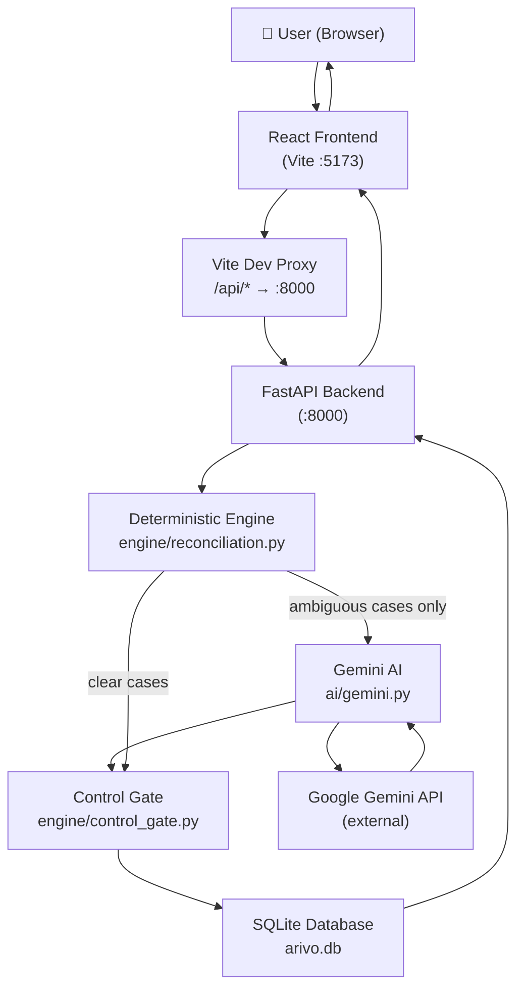

# Architecture

## Core Philosophy

> Use deterministic code where deterministic code is better (arithmetic, exact IDs, financial invariants).  
> Use AI where AI is better (ambiguity, semantic interpretation, human-friendly explanation).  
> Always gate AI output through deterministic controls before any final decision.

## System Diagram



## Component Map

| Layer | File(s) | Responsibility |
|---|---|---|
| Frontend entry | `frontend/src/main.tsx` | React root mount |
| App shell + routing | `frontend/src/App.tsx` | Sidebar nav, React Router |
| Pages | `frontend/src/pages/` | Overview, Reconciliation, Exceptions, Settlements, Ask |
| Shared API client | `frontend/src/api.ts` | `apiFetch()`, base URL |
| Evidence drawer | `frontend/src/components/EvidenceDrawer.tsx` | Case detail panel |
| Backend entry | `backend/main.py` | FastAPI app, all routes |
| Database models | `backend/database.py` | SQLAlchemy models + session |
| Reconciliation engine | `backend/engine/reconciliation.py` | Matching logic |
| Control Gate | `backend/engine/control_gate.py` | Financial invariant validation |
| AI module | `backend/ai/gemini.py` | Gemini client, prompts |
| Dataset generator | `dataset/generate_dataset.py` | Synthetic CSV generation |
| Benchmark | `evaluation/benchmark.py` | Accuracy measurement |
| CLI trigger | `scripts/run_reconciliation.py` | HTTP POST to run endpoint |

## Data Flow — Reconciliation Run

```
POST /api/reconciliation/run
        ↓
Load payments.csv + settlements.csv
        ↓
run_reconciliation() — deterministic engine
  ├── EXACT_ID match     → candidate{conflicting_evidence: false}
  ├── AMOUNT_MISMATCH    → candidate{conflicting_evidence: true}
  ├── AMOUNT_DATE match  → candidate{conflicting_evidence: true}
  ├── MULTIPLE candidates → candidate{multiple_candidates: true}
  └── NO_MATCH           → candidate{conflicting_evidence: false}
        ↓
For each ambiguous case (conflicting_evidence OR multiple_candidates):
  → investigate_case() → Gemini API
  → returns {recommended_decision, confidence, summary, ...}
        ↓
validate_match() — Control Gate
  Blocks if:
    amount_delta != 0
    multiple_candidates == true
    high_value == true  (>500,000 paise / ₹5,000)
    conflicting_evidence == true
        ↓
decide_final_status()
  PASS + EXACT_ID/NORMALIZED_ID/GROUPED → MATCHED
  PASS + AI says MATCHED                → MATCHED
  BLOCK + AI says EXCEPTION             → EXCEPTION
  BLOCK (default)                       → REVIEW
  AI says EXCEPTION                     → EXCEPTION
        ↓
Upsert ReconciliationCase to SQLite
        ↓
Return {cases_processed, cases_saved}
```

## Matching Strategy

| Method | Trigger | Conflict Flag |
|---|---|---|
| `EXACT_ID` | `payment_reference == REF-{payment_id}` and amounts match | `false` |
| `AMOUNT_MISMATCH` | Reference matches, amounts differ | `true` |
| `AMOUNT_DATE` | No reference match; single settlement with same gross amount | `true` |
| `MULTIPLE` | No reference match; >1 settlements with same amount | `true` |
| `NO_MATCH` | No reference, no amount match | `false` |

## Key Architectural Decisions

### 1. Control Gate is authoritative over Gemini
Gemini can recommend `MATCHED` with 99% confidence, but if the Control Gate detects a violation (high value, multiple candidates), the final status is `REVIEW` or `EXCEPTION`. This prevents AI from bypassing financial controls.

### 2. AI is only invoked for ambiguous cases
`EXACT_ID` matches with no amount delta bypass Gemini entirely. This keeps costs low and latency fast for the happy path.

### 3. Synchronous reconciliation run
The `POST /api/reconciliation/run` endpoint is synchronous. For the dataset size used in the hackathon (~5,000 rows), this is acceptable. For production, it should be moved to a background task queue.

### 4. Relative imports throughout backend
All backend modules use relative imports (`.engine`, `.ai`, etc.) so uvicorn can be launched from the project root as `backend.main:app`. This is the correct pattern.

### 5. No authentication
The application has no login/auth layer. It is designed for internal/demo use within a trusted environment.
