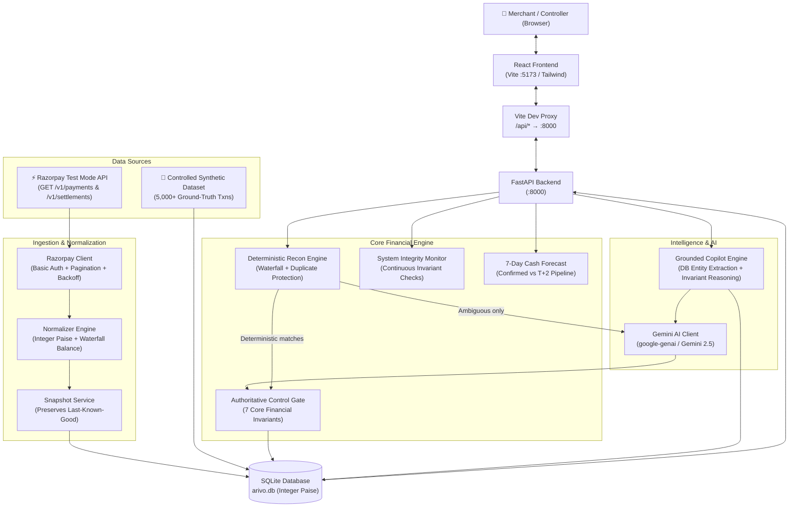

# ARIVO — System Architecture

## 1. Core Philosophy

> **"Know where every rupee went — or know exactly why you don't."**
> 
> *AI investigates. Rules verify. Controls protect. Arivo decides. Humans resolve ambiguity.*

In high-volume enterprise financial reconciliation, probabilistic machine learning models cannot be granted authority to reconcile ledger accounts or write off balance-sheet discrepancies. ARIVO resolves this by strictly decoupling **AI Investigation** from **Deterministic Decision Authority**:

1. **Deterministic Rules Engine**: Blazing fast exact-matching and waterfall arithmetic (11,900+ records/sec).
2. **Gemini AI Copilot**: Deep forensic investigation of genuine ambiguity, fee structure anomalies, and dispute narratives.
3. **Authoritative Control Gate**: Absolute veto authority. Enforces 7 financial invariants. Even 99% AI confidence cannot force an auto-match if invariants are violated.

---

## 2. System Architecture Diagram



---

## 3. Dual-Source Ingestion Architecture

ARIVO supports seamless switching between two environments:

| Source | Role | Data Guarantee |
|---|---|---|
| **Controlled Synthetic Benchmark** | Benchmark accuracy, edge cases, regression testing | 100% known ground truth, 5,114 txns, 0 false auto-matches |
| **Razorpay Test Mode** | Real-world provider integration | Live payments and settlements, rate-limit backoff, integer paise normalization |

---

## 4. The 7 Core Financial Invariants (Control Gate)

Every candidate match must clear the Authoritative Control Gate before being marked `MATCHED`. If any invariant fails, the match is blocked and routed to `REVIEW` or `EXCEPTION`:

1. **Zero Amount Delta**: Payment captured amount must exactly equal settlement gross amount ($\Delta = 0$).
2. **Single Candidate Uniqueness**: Only one matching settlement batch per payment reference.
3. **High-Value Protection**: Any transaction exceeding ₹50,000 (5,000,000 paise) requires human controller sign-off.
4. **No Conflicting Evidence**: Conflicting settlement references or dates block auto-clearance.
5. **Duplicate Allocation Prevention**: A settlement cannot be allocated to more than one payment.
6. **Settlement Waterfall Consistency**:
   $$\text{Expected Net} = \text{Gross} - \text{Fees} - \text{Tax} - \text{Refunds} - \text{Chargebacks} + \text{Adjustments}$$
   Any difference from deposited net is an `unexplained_delta`.
7. **Currency Uniformity**: Multi-currency cross-matching is blocked (strict INR minor unit accounting).

---

## 5. Flagship AI Safety Architecture

```
Record: PAY_FLAGSHIP_001 (₹6,00,000.00)
├── Gemini Assessment:       "High contextual match. Recommending auto-match." (Confidence: 97%)
├── Authoritative Gate:      BLOCK (Invariant: High-value transaction threshold exceeded)
└── ARIVO Controller:        REVIEW
                             Takeaway: "The AI is confident. The system is not."
```

---

## 6. Cash Forecasting Engine Architecture

- **Confirmed Cash**: Funds reconciled from `MATCHED` cases already credited to the merchant's bank account.
- **Expected Settlements (T+2 Pipeline)**: Captured payments awaiting settlement clearance modeled on Indian banking settlement windows (Day 1: 30%, Day 2: 40%, Day 3: 15%, Day 4: 8%, Day 5: 4%, Day 6: 3%).
- **Unresolved Exposure**: Funds held in `REVIEW` and `EXCEPTION` queues, explicitly subtracted from confirmed liquidity.
