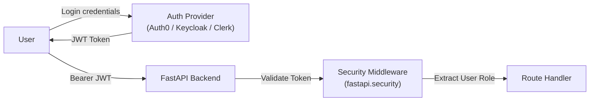

# Authentication & Authorization

## Current Status

**Status: Not Implemented (Trusted Internal Environment)**

Arivo currently operates without an authentication or authorization layer.

---

## Architectural Context

Arivo was designed as an internal finance controller application and proof-of-concept for the Razorpay AI Buildathon 2026. In this target deployment scenario:
1. The application runs locally or within a private VPN/intranet accessible only to authorized finance analysts.
2. Endpoints do not require bearer tokens, API keys, or session cookies.
3. All data views and reconciliation actions are open to any connected client.

---

## Security Implications

Because authentication is omitted:
- **Do not expose Arivo to the public internet** without a reverse proxy (e.g. Nginx, Cloudflare Zero Trust, or AWS ALB) enforcing OAuth2/OIDC authentication.
- **Do not bind the backend to `0.0.0.0`** in untrusted networks without firewall restrictions.
- All requests have full read/write access to `arivo.db`.

---

## Production Implementation Roadmap

If deploying to production, implement authentication as follows:

### 1. Token Handling (Backend)
- Use `fastapi.security.OAuth2PasswordBearer` or HTTPBearer.
- Verify incoming JWTs using public keys (JWKS).
- Restrict sensitive actions (e.g., `POST /api/reconciliation/run`) to users with the `FinanceAdmin` role.

### 2. Role-Based Access Control (RBAC)
- `Viewer`: Can browse dashboard, view reconciliation cases, and ask questions.
- `Controller / Analyst`: Can manually reclassify cases from `REVIEW` to `MATCHED` or `EXCEPTION`.
- `Admin`: Can trigger dataset generation and batch reconciliation runs.
