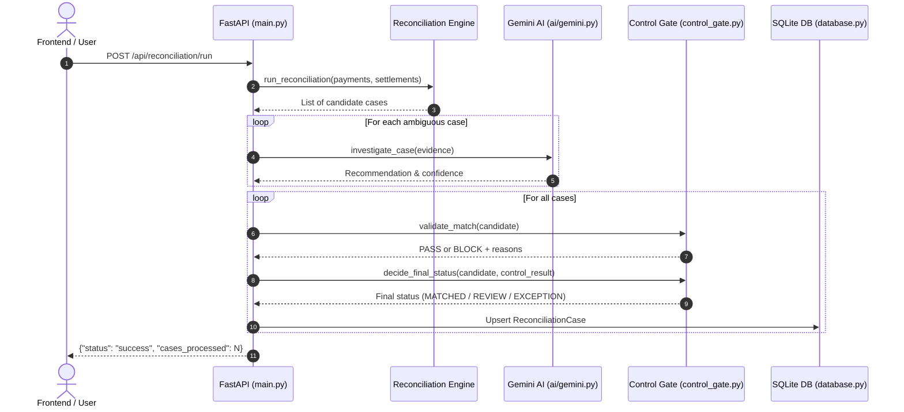

# Backend Architecture & Implementation

## Technology Stack

- **Framework**: FastAPI (Python 3.11–3.13)
- **ASGI Server**: Uvicorn with reload support
- **Database & ORM**: SQLite 3 via SQLAlchemy 2.0
- **Data Manipulation**: Python standard libraries (`csv`, `json`, `uuid`, `os`) + `pandas`
- **Environment**: `python-dotenv`
- **Port**: `8000`

---

## Directory Structure

```
backend/
├── __init__.py              # Package marker
├── main.py                  # Application entry point, routes, lifecycle
├── database.py              # SQLAlchemy engine, session maker, DB models
├── requirements.txt         # Unpinned, compatible Python dependencies
├── arivo.db                 # SQLite database file (generated)
├── ai/
│   ├── __init__.py
│   └── gemini.py            # Gemini client using modern google-genai SDK
├── engine/
│   ├── __init__.py
│   ├── reconciliation.py    # Deterministic matching algorithms
│   └── control_gate.py      # Financial invariant validation & final decision
└── tests/
    ├── __init__.py
    └── test_reconciliation.py # Pytest unit test suite
```

---

## Request Lifecycle



---

## Key Modules

### 1. Deterministic Engine (`backend/engine/reconciliation.py`)
Matches incoming payment records against settlement batches:
1. **Exact ID Match**: Checks if `REF-{payment_id}` equals `settlement.payment_reference`.
2. **Amount Mismatch Detection**: When reference matches but amounts disagree.
3. **Amount/Date Match**: When no reference exists, checks for unique settlement matching gross payment amount.
4. **Multiple Candidates**: When multiple settlements share the same amount, flagged as ambiguous.
5. **No Match**: When no matching settlement exists.

### 2. Control Gate (`backend/engine/control_gate.py`)
Enforces financial controls. A match is **BLOCKED** if:
- `amount_delta != 0`: Any discrepancy in monetary figures.
- `multiple_candidates == True`: Potential collision risk.
- `high_value == True`: Transaction exceeds threshold (₹5,000 / 500,000 paise).
- `conflicting_evidence == True`: Ambiguities in identifiers or references.

The function `decide_final_status` guarantees that a Control Gate `BLOCK` cannot be silently converted to `MATCHED`, even if Gemini recommends it.

### 3. AI Module (`backend/ai/gemini.py`)
Uses `google-genai` to call Gemini models using JSON mode (`response_mime_type="application/json"`). Includes error handling and fallback defaults to prevent server crashes.

### 4. Database Layer (`backend/database.py`)
Configures SQLite with absolute path resolution relative to the project root, preventing database file fragmentation across different working directories.
