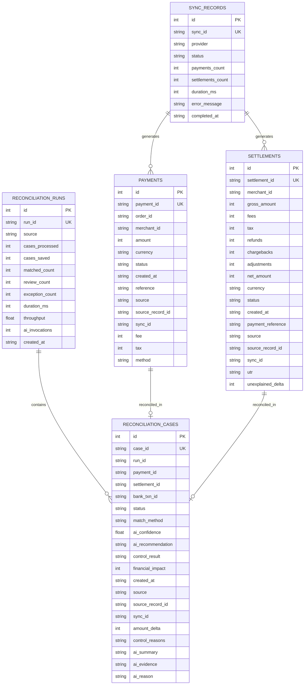

# Database Schema & Storage

ARIVO uses SQLite via SQLAlchemy ORM for local persistent storage with deterministic minor currency units (paise) and non-destructive column evolution.

## 1. Engine & Configuration

- **Engine**: SQLite 3
- **ORM**: SQLAlchemy (Declarative Base)
- **File Location**: `arivo.db` at project root
- **Connection**: Managed in `backend/database.py` with `check_same_thread: False`
- **Integer Minor Units**: All monetary values (`amount`, `gross_amount`, `net_amount`, `fee`, `tax`, `financial_impact`, `unexplained_delta`) are stored strictly as minor unit integers (paise).

---

## 2. Entity Relationship Diagram



---

## 3. Non-Destructive Migrations (`_ensure_sqlite_columns`)

ARIVO implements a non-destructive runtime schema migration function:
```python
_ensure_sqlite_columns(engine)
```
Upon startup, it inspects existing SQLite table columns via `PRAGMA table_info`. If any newly introduced columns are missing, it executes `ALTER TABLE ADD COLUMN` dynamically without dropping existing data or losing existing reconciliation state.
