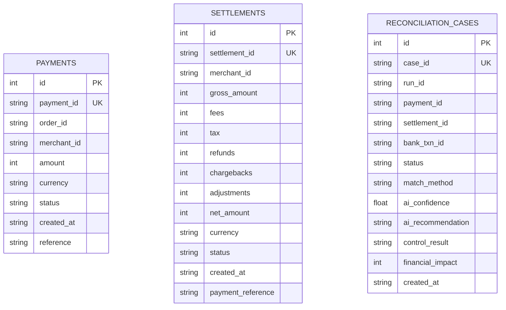

# Database Schema & Storage

Arivo uses SQLite via SQLAlchemy ORM for local persistent storage.

## Database Technology

- **Engine**: SQLite 3
- **ORM**: SQLAlchemy (Declarative Base)
- **File Location**: `arivo.db` at project root
- **Connection**: Managed in `backend/database.py` with `check_same_thread: False`

---

## Entity Relationship & Schema



---

## Model Definitions

### 1. `reconciliation_cases`
Main operational audit table recording the reconciliation decisions.

| Column | Type | Constraints | Description |
|---|---|---|---|
| `id` | Integer | PK, Index | Auto-increment primary key |
| `case_id` | String | Unique, Index | Unique case identifier (e.g. `CASE_A1B2C3D4`) |
| `run_id` | String | Index | Batch run identifier (e.g. `RUN_F9E8D7C6`) |
| `payment_id` | String | Nullable, Index | Associated payment ID |
| `settlement_id` | String | Nullable, Index | Associated settlement ID |
| `bank_txn_id` | String | Nullable | Associated bank statement transaction ID |
| `status` | String | Non-null | Final status: `MATCHED`, `REVIEW`, or `EXCEPTION` |
| `match_method` | String | Nullable | Method used (`EXACT_ID`, `AMOUNT_DATE`, `MULTIPLE`, `NO_MATCH`) |
| `ai_confidence` | Float | Nullable | Gemini confidence score between `0.0` and `1.0` |
| `ai_recommendation` | String | Nullable | Recommendation from Gemini (`MATCHED`, `REVIEW`, `EXCEPTION`) |
| `control_result` | String | Nullable | Control Gate verdict (`PASS` or `BLOCK`) |
| `financial_impact` | Integer | Default 0 | Transaction amount in minor units (paise) |
| `created_at` | String | Non-null | ISO 8601 UTC timestamp |

### 2. `payments`
Schema representing ingested payment gateway records.

| Column | Type | Constraints | Description |
|---|---|---|---|
| `id` | Integer | PK, Index | Auto-increment primary key |
| `payment_id` | String | Unique, Index | Unique payment identifier |
| `order_id` | String | Index | Order reference |
| `merchant_id` | String | Index | Merchant identifier |
| `amount` | Integer | Non-null | Payment amount in paise |
| `currency` | String | Default "INR" | 3-letter currency code |
| `status` | String | Non-null | Gateway status (`captured`, `refunded`, etc.) |
| `created_at` | String | Non-null | Timestamp |
| `reference` | String | Nullable | Optional external reference |

### 3. `settlements`
Schema representing settlement batches and waterfalls.

| Column | Type | Constraints | Description |
|---|---|---|---|
| `id` | Integer | PK, Index | Auto-increment primary key |
| `settlement_id` | String | Unique, Index | Unique settlement batch identifier |
| `merchant_id` | String | Index | Merchant identifier |
| `gross_amount` | Integer | Non-null | Gross settled amount in paise |
| `fees` | Integer | Non-null | Deducted gateway fees |
| `tax` | Integer | Non-null | GST/tax deducted |
| `refunds` | Integer | Non-null | Deducted refund amounts |
| `chargebacks` | Integer | Non-null | Deducted chargeback amounts |
| `adjustments` | Integer | Non-null | Adjustments (+ or -) |
| `net_amount` | Integer | Non-null | Net amount credited |
| `currency` | String | Default "INR" | Currency |
| `status` | String | Non-null | Settlement status |
| `created_at` | String | Non-null | Timestamp |
| `payment_reference` | String | Nullable | Matched payment reference (e.g. `REF-PAY_1001`) |

---

## Migrations & Initialization

Tables are auto-created on application startup via SQLAlchemy:
```python
Base.metadata.create_all(bind=engine)
```

No external migration tools (like Alembic) are currently configured. Database schema changes require deleting `arivo.db` and re-running the application.
