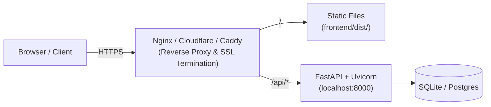

# Deployment Guide

This document outlines the build and deployment process for production environments.

---

## Architecture Overview

In production, Arivo consists of:
1. **Frontend**: Static single-page application (SPA) bundle served via Nginx, Caddy, Cloudflare Pages, or AWS S3 + CloudFront.
2. **Backend**: Python ASGI service running under Uvicorn/Gunicorn behind a reverse proxy.
3. **Database**: SQLite (for single-node deployments) or PostgreSQL (for multi-node scaled deployments).



---

## 1. Frontend Build

Build the production assets:

```bash
cd frontend
npm run build
```

This invokes `tsc && vite build`, creating optimized assets in `frontend/dist/`:
- Bundled and minified JavaScript with content hashing
- Purged CSS via Tailwind
- Single `index.html` entry point

### Production Environment Variables
If the API is hosted on a separate domain, specify `VITE_API_URL` during build:
```bash
VITE_API_URL="https://api.yourdomain.com" npm run build
```

---

## 2. Backend Production Run

For production deployment:
1. Do not use `--reload`.
2. Bind to internal interface or socket.
3. Use multi-worker process management.

```powershell
# Using Python directly
.\venv\Scripts\python -m uvicorn backend.main:app --host 127.0.0.1 --port 8000 --workers 4
```

### Systemd Service Example (Linux Production)
```ini
[Unit]
Description=Arivo Backend Service
After=network.target

[Service]
User=arivo
WorkingDirectory=/opt/arivo
ExecStart=/opt/arivo/venv/bin/uvicorn backend.main:app --host 127.0.0.1 --port 8000 --workers 4
EnvironmentFile=/opt/arivo/.env
Restart=always

[Install]
WantedBy=multi-user.target
```

---

## 3. Reverse Proxy Configuration (Nginx Example)

```nginx
server {
    listen 80;
    server_name arivo.internal.company.com;

    # Serve React SPA
    location / {
        root /opt/arivo/frontend/dist;
        index index.html;
        try_files $uri $uri/ /index.html;
    }

    # Proxy API requests to FastAPI
    location /api/ {
        proxy_pass http://127.0.0.1:8000/api/;
        proxy_set_header Host $host;
        proxy_set_header X-Real-IP $remote_addr;
        proxy_set_header X-Forwarded-For $proxy_add_x_forwarded_for;
        proxy_set_header X-Forwarded-Proto $scheme;
    }
}
```

---

## 4. Health Checks

Use the `/api/health` endpoint for load balancer health probes:
- Expected Status: `200 OK`
- Expected Body: `{"status": "ok", "service": "arivo"}`
