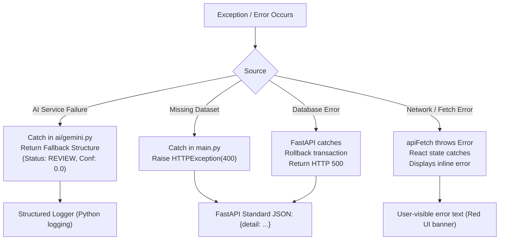

# Error Handling Strategy

Arivo implements multi-layered error handling across the frontend, API, database, deterministic engine, and AI integration.

---

## Error Handling Flow



---

## 1. AI Layer Error Handling (`backend/ai/gemini.py`)

External LLM calls are inherently non-deterministic and prone to network drops, rate limits, or schema deviations.

### Catching & Fallback
All calls inside `investigate_case` are enclosed in a `try...except` block:
```python
try:
    client = _get_client()
    response = client.models.generate_content(...)
    result = json.loads(response.text)
    # Schema check
    if result.get("recommended_decision") not in {"MATCHED", "REVIEW", "EXCEPTION"}:
        return fallback
    return result
except Exception as e:
    logger.error(f"[Gemini] investigate_case error: {e}")
    return fallback
```

### Safety Invariant
The fallback structure explicitly sets:
- `recommended_decision`: `"REVIEW"`
- `confidence`: `0.0`
- `classification`: `"AI_FAILURE"`

**This guarantees that an AI crash never causes a transaction to be automatically matched.**

---

## 2. API & Backend Errors (`backend/main.py`)

FastAPI converts exceptions into HTTP responses:
- **HTTP 400**: Triggered explicitly when preconditions fail (e.g. missing CSV data files or empty question queries):
  ```python
  if not os.path.exists(payments_path):
      raise HTTPException(status_code=400, detail="Dataset not found. Run: make generate-data")
  ```
- **HTTP 422**: Automatically raised by FastAPI/Pydantic when request payloads are missing required fields or contain incorrect data types.
- **HTTP 500**: Unhandled exceptions are logged with stack traces to standard error and return an internal server error response.

---

## 3. Database Errors (`backend/database.py`)

Database transactions utilize dependency-injected sessions:
```python
def get_db():
    db = SessionLocal()
    try:
        yield db
    finally:
        db.close()
```
If an exception occurs during `start_reconciliation`, uncommitted transactions are discarded, preserving the integrity of the SQLite database.

---

## 4. Frontend Error Handling (`frontend/src/api.ts`)

The central `apiFetch` wrapper handles HTTP status codes explicitly:
```typescript
if (!res.ok) {
  const text = await res.text().catch(() => res.statusText);
  throw new Error(`[${res.status}] ${path}: ${text}`);
}
```

React pages capture this error via `.catch()` and render explicit messages to the user:
- **Overview**: Displays red error text under the stats grid if metrics fail to load.
- **Reconciliation & Exceptions**: Displays an error banner if the table cannot fetch cases, rather than an empty loading spinner.
- **Ask Arivo**: Displays an inline assistant message stating `Error: [Status] /api/ask: <message>` rather than failing silently.
