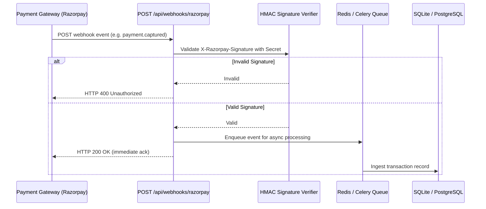

# Webhooks Reference

## Current Status

**Status: Not Implemented (Batch Processing Architecture)**

Arivo does not currently expose incoming webhook endpoints or emit outgoing webhooks.

---

## Rationale

Reconciliation systems operate across two distinct operational paradigms:
1. **Real-time Event Ingestion (Webhooks)**: Capturing instantaneous state transitions (`payment.authorized`, `payment.captured`, `refund.processed`).
2. **Settlement Clearing & Settlement Reconciliation (Batch Reports)**: Comparing cleared bank deposits and end-of-day gateway settlement files against internal transaction ledgers.

Arivo addresses the **Clearing & Settlement Reconciliation** phase. Banks and payment processors issue settlement files as batched end-of-day extracts (T+1 or T+2). Consequently, Arivo utilizes file-based batch processing (`payments.csv`, `settlements.csv`) rather than streaming webhooks.

---

## Production Roadmap: Adding Webhook Support

To enable real-time ingestion from payment gateways such as Razorpay, the following architecture should be implemented:

### Key Security Requirements for Webhooks:
- **Signature Verification**: Validate `X-Razorpay-Signature` against `RAZORPAY_WEBHOOK_SECRET` using HMAC SHA256 before parsing body.
- **Idempotency**: Store incoming event IDs (`event_id`) in a dedicated `webhook_events` table to reject duplicate deliveries.
- **Fast Acknowledgment**: Return HTTP 200 within 2 seconds; offload reconciliation processing to an asynchronous worker queue.
