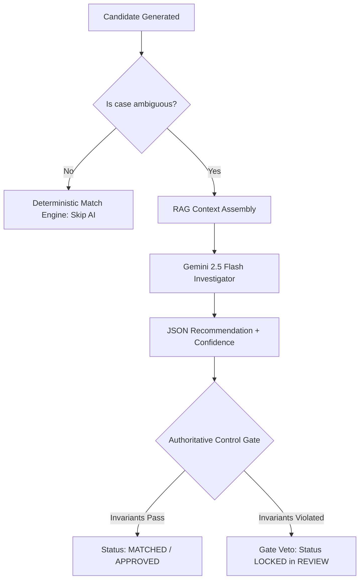

# Gemini Investigation Engine

> **Module:** `backend/ai/gemini.py`  
> **Model:** Google Gemini 2.5 Flash (`gemini-2.5-flash`) via `google-genai` SDK  
> **Boundary:** Analytical Advisor (Non-Authoritative)

ARIVO integrates Google Gemini 2.5 Flash to investigate complex financial ambiguities, candidate collisions, and fee structure anomalies.

---

## 1. Architectural Role & Non-Authoritative Boundary

In ARIVO, Generative AI is strictly an **investigative advisor**. It parses unstructured metadata, evaluates context, and proposes recommendations. It possesses **zero authority** to write directly to ledgers or finalize matches.



---

## 2. Structured JSON Output Schema

ARIVO configures the Gemini client with strict JSON schema enforcement:

```json
{
  "recommendation": "MATCHED",
  "confidence": 0.97,
  "supporting_evidence": [
    "Gross captured volume matches candidate net within standard fee tolerance",
    "UTR reference matches Axis Bank settlement window"
  ],
  "identified_risks": [
    "Identical amount candidate exists in batch SET_FLAGSHIP_001B",
    "Transaction amount exceeds high-value threshold (INR 50,000)"
  ],
  "settlement_analysis": "Primary candidate SET_FLAGSHIP_001A aligns temporally with order confirmation.",
  "discrepancy_explanation": "Zero paise delta observed across gross captured volume."
}
```

---

## 3. The Flagship Safety Invariant: "The AI is Confident. The System is Not."

When Gemini investigates high-value transactions with multiple candidates (e.g., `PAY_FLAGSHIP_001`, ₹6,00,000.00), it may identify plausible narrative correlations and emit **97% confidence**.

However, the deterministic Control Gate enforces **Invariant 2 (Candidate Uniqueness)** and **Invariant 3 (High-Value Exposure Boundary)**:
- **AI Recommendation:** `MATCHED` (97% Confidence)
- **Control Gate:** `BLOCK`
- **Final Decision:** `REVIEW`

This absolute veto protects merchants from AI hallucinations and eliminates false auto-matches.

---

## 4. Deterministic Fallback Mode

To guarantee uninterrupted operations during network partitions or API quota limits:
- **Timeout:** Maximum 15-second HTTP deadline.
- **Quota / Rate Limit (HTTP 429):** Caught gracefully.
- **Fallback Behavior:** If Gemini fails, the case is routed to the deterministic heuristic ranker, tagged with `ai_investigation.used = false` and `fallback_mode = true`, and held safely in `REVIEW`.
