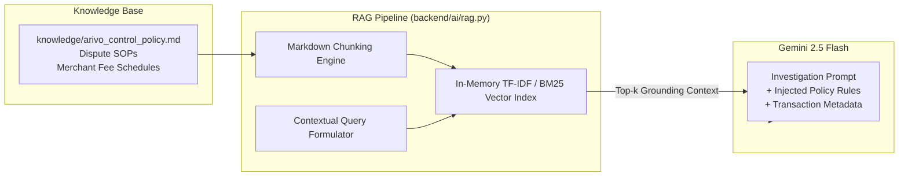

# Retrieval-Augmented Generation (RAG) System

> **Module:** `backend/ai/rag.py`  
> **Knowledge Store:** `knowledge/` (`arivo_control_policy.md`, policy specs)  
> **Target:** In-Context Grounding for Gemini Investigation & Natural Language Copilot

ARIVO uses a lightweight, zero-dependency in-process RAG retriever to ground Gemini 2.5 Flash investigations in authoritative financial reconciliation policies and enterprise merchant contracts.

---

## 1. Architecture

---

## 2. Chunking & Indexing

- **Granular Policy Rules:** The policy document `knowledge/arivo_control_policy.md` is segmented by invariant and section boundaries (`### Section N`).
- **Keyword & Vector Matching:** Chunks are indexed using token frequencies, UTR patterns, fee terms, and dispute conditions.
- **Top-K Retrieval:** When an ambiguous case or natural language question arrives, the top 3 most relevant policy chunks are extracted and injected into the prompt system context.

---

## 3. Copilot Grounding (`/api/ask`)

The natural language controller copilot (`POST /api/ask`) relies on the RAG pipeline to provide authoritative, cited explanations:
- Every answer includes exact references to case IDs and policy invariant numbers (e.g., `INV-002`, `INV-003`).
- Prevents LLM hallucinations when explaining why transactions were held in review.
